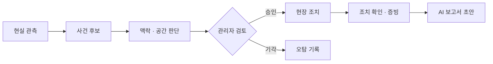

<div align="center">

# SENTIA

### SENTient Intelligence & Action

Sense. Understand. Act.

건설 현장의 AI 탐지 결과를 공간·시간·작업 맥락과 결합해  
관리자의 판단부터 현장 조치·확인·기록·보고까지 연결하는  
경량 안전 운영 플랫폼

</div>

---

## SENTIA

SENTIA는 단순한 객체 탐지 프로그램이나 CCTV 대시보드가 아니다.

현장에서 관측한 정보와 작업계획·위험성평가 같은 업무 정보를 연결하고, AI가 고른 사건 후보를 관리자가 검토한 뒤 실제 현장 조치와 기록까지 이어 주는 안전 운영 시스템을 설계한다.

이 저장소는 SENTIA의 제품 방향, 팀 역할, 시스템 구조, 프로젝트 범위와 일정, 조사 기록을 관리하기 위한 기획·설계 저장소다.

## 해결하려는 문제

| 핵심 문제 | SENTIA의 접근 |
|---|---|
| 오탐과 맥락 부족 | 탐지 결과를 바로 경보로 보내지 않고 공간·시간·작업 맥락을 더한 뒤 관리자가 승인하거나 기각한다 |
| 공간 정보 단절 | 카메라·도면·현장 정보를 현장·층·구역 기준의 공간 상태로 연결한다 |
| 조치와 기록 단절 | 승인된 사건을 현장 조치, 조치 확인, 증빙, 이력, AI 보고서 초안까지 이어 준다 |

## 핵심 흐름



AI는 검토할 상황을 선별하고, 실제 조치 여부는 관리자가 판단한다.  
전체 시스템 구조는 [03 · 시스템 개념](docs/03-system-concept.md)에서 확인할 수 있다.

## 문서 안내

처음 보는 경우 **01 → 02 → 03 → 04** 순서로 읽는 것을 권장한다.

| 문서 | 답하는 질문 | 주요 내용 |
|---|---|---|
| [01 · 프로젝트 개요](docs/01-project-overview.md) | 왜 만들고 무엇을 해결하는가? | 배경, 핵심 문제, 사용자, 제품 방향 |
| [02 · 팀과 역할](docs/02-team-and-roles.md) | 누가 무엇을 책임지는가? | AI·백엔드·프런트엔드 역할과 책임 경계 |
| [03 · 시스템 개념](docs/03-system-concept.md) | 시스템이 어떻게 동작하는가? | 관측 → 판단 → 조치 → 보고의 정보 흐름 |
| [04 · 범위와 계획](docs/04-scope-and-plan.md) | 이번 프로젝트에서 어디까지 만드는가? | 범위, 일정, 진행 관문, 팀 합의 항목 |

전체 문서 목차는 [docs/README.md](docs/README.md)에서 확인한다.

## 저장소 구조

```text
sentia-planning/
├─ docs/
│  ├─ 00-discovery/
│  │  └─ sessions/
│  ├─ 01-project-overview.md
│  ├─ 02-team-and-roles.md
│  ├─ 03-system-concept.md
│  ├─ 04-scope-and-plan.md
│  └─ README.md
│
├─ inspection/
│  └─ smart-safety-system-limitations.docx
│
└─ README.md
```

- [docs/](docs/README.md): 현재 제품 기획과 설계 문서
- [docs/00-discovery/](docs/00-discovery/): 현재 정본에 도달하기까지의 조사·논의 기록
- [inspection/](inspection/): 별도 조사 산출물
- [스마트 안전 시스템 한계 조사](inspection/smart-safety-system-limitations.docx): 스마트 안전 시스템의 현황과 한계 관련 조사 자료

## 문서 기준

[01~04 문서](docs/README.md#현재-정본)가 현재 팀이 공유하는 기획·설계 기준이다.

`docs/00-discovery/`는 조사와 논의가 어떻게 발전했는지 추적하기 위한 기록이며, 현재 정본과 내용이 다를 수 있다. 제품 방향이나 역할·범위 판단이 필요할 때는 01~04를 우선한다.

세부 구현 명세, API 계약, DB 설계, 개인별 작업 목록은 이 저장소의 현재 핵심 문서와 분리해서 관리한다.

## 현재 방향

### 제품 구조에 포함

- 사건 후보와 관리자 승인·기각
- 현장·층·구역 기준의 공간 관제
- 승인된 사건의 현장 조치 전달
- 수신 확인, 조치 확인, 증빙과 이력
- 이력과 증빙을 바탕으로 한 AI 보고서 초안
- 최종 위험 판단과 보고서 확정은 사람이 수행

### 팀 합의가 필요한 항목

- 핵심 시연 사건과 관측 입력원
- 현장 수신 단말의 구현 형태
- AI 보고서의 종류·서식·실행 위치와 담당
- VLM 적용 범위
- 2D·2.5D 구현 깊이

### 조건부 확장

- 3DGS
- BIM 고도화
- Unreal
- 다중 카메라와 객체 재식별
- 열화상·장비 운행 정보·착용형 센서

최신 범위와 일정은 [04 · 범위와 계획](docs/04-scope-and-plan.md)을 기준으로 한다.

## 기술 방향

| 영역 | 주요 기술 |
|---|---|
| AI | Python · PyTorch · YOLO · OpenCV |
| Backend | Java · Spring Boot · PostgreSQL · Redis |
| Frontend | React · TypeScript · Canvas · Three.js |
| 실행 환경 | Docker · Nginx · 필요 시 GPU·CUDA |

기술 목록은 제품 범위를 자동으로 결정하지 않으며, 실제 적용 여부는 검증 결과와 팀 합의에 따라 달라질 수 있다.

---

<div align="center">

[프로젝트 개요](docs/01-project-overview.md) ·
[팀과 역할](docs/02-team-and-roles.md) ·
[시스템 개념](docs/03-system-concept.md) ·
[범위와 계획](docs/04-scope-and-plan.md) ·
[문서 전체 보기](docs/README.md)

</div>
