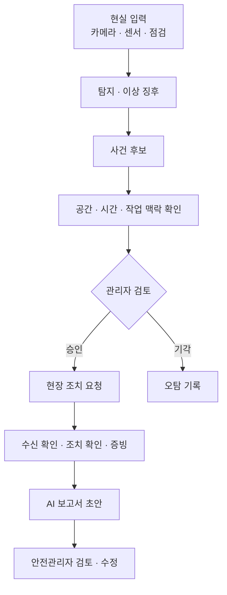

# SENTIA 프로젝트 개요

> **SENTIA** (SENTient Intelligence & Action)
>
> 건설 현장의 AI 탐지 결과를 공간·시간·작업 맥락과 결합해 실제로 확인이 필요한 위험을 골라내고, 관리자의 승인을 거쳐 현장 조치, 조치 확인, 기록, 보고까지 이어 주는 경량 안전 운영 플랫폼

SENTIA는 단순한 객체 탐지 프로그램이나 CCTV 대시보드가 아니다.
현장에서 관측한 정보와 작업계획·위험성평가 같은 업무 정보를 연결하고, AI가 고른 사건 후보를 관리자가 검토한 뒤 실제 조치와 기록까지 이어 주는 운영 시스템이다.
SENTIA가 답하려는 질문은 네 가지다. 무엇이 보이는가, 실제로 위험한가, 어디에서 일어났고 무엇을 해야 하는가, 누가 조치했고 결과를 어떻게 남기는가.

## 배경

건설 현장에는 AI CCTV, IoT 센서, 작업자 위치 관제, BIM 기반 관제 같은 스마트 안전 기술이 빠르게 도입되고 있다.
하지만 기술을 도입했다고 해서 안전 업무가 매끄럽게 돌아가는 것은 아니다.
경보는 늘었지만, 그 경보를 확인하고 현장에 전달하고 결과를 기록하는 일은 여전히 사람이 여러 도구를 오가며 처리한다.

## 핵심 문제

### 오탐과 맥락 부족

Vision AI는 사람, 장비, 보호구, 균열처럼 눈에 보이는 대상을 찾는 데는 강하지만, 그 대상이 실제 현장 상황에서 위험한지까지 판단하지는 못한다.
예를 들어 다음과 같은 오탐이 생길 수 있다.

- 정상적으로 장비를 유도하는 신호수를 중장비 접근 위험으로 판단한다.
- 잠깐 안전모를 벗은 상황에도 경보를 반복한다.
- 타설 흔적, 그림자, 조명 변화를 구조 결함으로 오인한다.
- 새로운 현장이나 카메라 조건에서 탐지 성능이 떨어진다.

오탐이 반복되면 관리자는 경보를 믿지 않게 되고, 결국 관제 기능 자체를 쓰지 않게 될 수 있다.

### 공간 정보 단절

현장 정보는 CCTV 화면, 도면, BIM, 점검 사진, 센서처럼 서로 다른 형태로 흩어져 있다.
관리자는 여러 CCTV 분할 화면을 보면서 위험이 어느 층의 어느 구역에서 일어났는지 직접 해석해야 한다.
반대로 고도화된 3D·BIM 관제는 공간 정보를 풍부하게 보여 줄 수 있지만, 좌표 맞춤, 모델 변환, 초기 구축, 잦은 현장 변경에 따른 운영 부담이 생길 수 있다.

### 조치와 기록 단절

위험을 탐지한 뒤에도 사람이 영상을 다시 확인하고, 전화·무전·메신저로 상황을 전달하고, 조치 결과를 엑셀·HWP·수기 문서에 옮겨 적는 일이 반복된다.
문제는 경보 자체보다 확인, 현장 전달, 조치, 조치 확인, 증빙, 보고로 이어지는 연결 과정에 있다.

## 제품 대응

SENTIA는 세 가지 핵심 문제에 다음과 같이 대응한다.

| 핵심 문제 | SENTIA의 대응 |
|---|---|
| 오탐과 맥락 부족 | 탐지 결과를 바로 경보로 보내지 않고 사건 후보로 선별한다. 공간·시간·작업 맥락으로 후보를 보강한 뒤 관리자가 승인하거나 기각한다. |
| 공간 정보 단절 | 모든 관측을 현장 좌표와 층·구역 기준의 공간 상태로 바꾸고, 도면 기반 2D·2.5D 화면에서 관제한다. |
| 조치와 기록 단절 | 승인된 사건을 현장 조치 요청으로 전달하고, 수신 확인, 조치 확인, 증빙을 이력으로 남긴다. 이 이력을 바탕으로 AI 보고서 초안을 만든다. |

세 가지 대응은 부가 기능이 아니라 SENTIA가 하나의 제품으로 성립하기 위한 기본 구조다.
구체적인 사건 종류, 현장 수신 단말, 보고서 형식, 구현 깊이는 [04-scope-and-plan.md](./04-scope-and-plan.md)에서 팀 합의로 정한다.

## 대상 사용자

**안전관리자**는 SENTIA의 핵심 사용자다.
작업계획과 위험성평가를 확인하고, 사건 검토 대기열과 공간 관제 화면을 보면서 사건 후보를 승인하거나 기각한다.
승인한 사건에 대해 현장 조치를 요청하고, 조치와 증빙을 확인하며, AI 보고서 초안을 검토한다.
주로 도면 기반 관제 화면을 사용하며, 빠른 알림을 위해 스마트워치나 모바일 같은 단말도 제품 방향에 포함한다.

**현장 작업자**는 승인된 조치를 실제로 수행한다.
작업 중에도 확인 부담이 적은 단말로 조치 요청을 받고, 수신을 확인한 뒤, 현장에서 대응하고 완료 결과와 증빙을 남긴다.
이번 프로젝트에서 이 단말을 어떤 형태로 구현할지는 팀이 정한다.
다만 조치 요청이 관리자 화면에서 끝나지 않고 현장 전달과 응답까지 이어져야 한다는 방향은 유지한다.

그 밖에 다음 사용자도 고려한다.

- 관리감독자·공사 담당자: 작업을 지휘하고 현장 조치를 실행한다.
- 관제 운영자: CCTV와 센서 같은 스마트 안전장비를 운영한다.
- 현장·본사 담당자: 이력과 보고 결과를 활용한다.

## 현장 업무

안전관리 업무는 하루 단위로 반복된다.

| 시점 | 주요 업무 |
|---|---|
| 작업 전 | 작업계획 확인 → 위험성평가 → TBM(작업 전 안전점검회의) |
| 작업 중 | 관측 → 위험 판단 → 승인·기각 → 조치 |
| 작업 후 | 조치 확인 → 증빙 → 기록·보고 → 위험성평가 반영 |

안전관리자의 핵심 업무는 CCTV를 계속 지켜보는 일이 아니다.
SENTIA는 확인이 필요한 현장 상황을 골라 주고, 관리자가 판단한 결과를 현장에 전달하고, 조치 결과를 기록하는 과정의 부담을 줄인다.

## 핵심 흐름

SENTIA의 흐름을 요약하면 다음과 같다.

AI는 검토가 필요한 상황을 골라 주고, 실제로 조치할지는 관리자가 결정한다.
기각된 후보는 현장에 전달하지 않고 오탐 기록으로 남겨, 운영 품질을 확인하고 판단 기준을 개선하는 자료로 쓴다.
작업자 위치를 보여 주는 실시간 관제는 이 판단·보고 과정과 분리되어 있어서, 후속 처리가 느려져도 멈추지 않는다.
시스템 전체 흐름은 [03-system-concept.md](./03-system-concept.md)에서 자세히 설명한다.

## 공간 관제

SENTIA는 화면 좌표가 아니라 현장 좌표를 공간 정보의 기준으로 삼는다.
카메라 화면의 위치는 다음 순서로 현장의 위치가 된다.

카메라 화면 좌표 → 도면 좌표 → 현장 좌표 → 층·구역

그래서 관리자는 "3번 카메라에서 경보가 울렸다"가 아니라 "3층 B구역에서 철근 배근 중에 안전모 미착용이 지속되고 있다"처럼 상황을 이해할 수 있다.

2D·2.5D 화면은 위험이 어디에서 일어났는지 빠르게 파악하고 조치를 지시하기 위한 운영 화면이다.
이 화면에는 작업자와 장비, 카메라와 촬영 범위, 위험구역, 사건 후보와 승인된 사건을 표시할 수 있다.
제품 범위에 따라 구조물 결함, 센서 상태, 현장 변화도 같은 공간 위에 표시할 수 있다.

## AI 보고서

보고서 작성은 조치와 기록 단절 문제를 해결하는 마지막 단계다.
SENTIA는 보고서에 필요한 정보를 이미 구조화된 형태로 가지고 있다.

- 사건과 관리자의 승인·기각 기록
- 발생 위치와 작업 맥락
- 조치 내용과 조치 담당자
- 수신 확인과 조치 확인 결과
- 증빙 자료
- 시간순 처리 이력
- 오탐 통계

AI는 이 정보를 바탕으로 보고서 초안을 만들고, 안전관리자는 초안을 검토하고 수정한 뒤 안전일지, 조치 보고, 아차사고 기록, 위험성평가 반영 자료로 활용한다.
AI가 최종 문서를 자동으로 확정하지 않으며, 확정은 항상 사람이 한다.

## 확장 방향

SENTIA는 무거운 3D 시스템을 새로 만드는 것을 목표로 하지 않는다.
공간·사건·시간 정보를 화면 표현과 분리해서 관리하고, 필요할 때 표현 방식을 넓힌다.

| 표현 방식 | 역할 |
|---|---|
| Canvas / SVG | 2D 관제 |
| Three.js | 2.5D·경량 3D |
| 3DGS | 실제 현장 모습 재현 |
| BIM / 3D 메시 | 구조·형상·객체 정보 |
| Unreal | 고도화된 3D 관제와 시뮬레이션 |

2D·2.5D 관제가 기본 제품이다.
3DGS, BIM, Unreal은 실제 현장의 모습을 주기적으로 연결하는 전략적 확장으로 유지하되, 이번 프로젝트에서 어디까지 구현할지는 핵심 제품의 상태와 일정에 따라 정한다.

## 현재 상태

| 상태 | 내용 |
|---|---|
| 방향 확정 | 세 가지 핵심 문제를 모두 제품 구조에서 해결한다 사건 후보와 관리자 승인·기각을 분리한다 공간 정보는 현장·층·구역 기준으로 연결한다 승인된 사건은 현장 조치, 조치 확인, 증빙으로 이어진다 이력과 증빙을 AI 보고서 초안으로 연결한다 최종 위험 판단과 보고서 확정은 사람이 한다 실시간 관제와 후속 판단·보고 처리를 분리한다 |
| 팀 합의 필요 | 핵심 시연 흐름에 사용할 구체 사건 핵심 관측 대상과 입력원 현장 수신 단말의 구현 형태 AI 보고서 종류와 형식 VLM을 적용할 사건과 모델 2D·2.5D 구현 깊이 |
| 검증 필요 | 모델 성능과 오탐 수준 객체 추적과 카메라 보정 품질 사건 후보 처리 지연 현장 전달 방식의 재현성 AI 보고서 초안 품질 모의 현장과 실제 데이터 확보 |
| 조건부 확장 | 3DGS BIM 고도화 Unreal 열화상·장비 운행 정보·착용형 센서 다중 카메라 |
