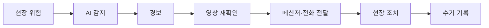
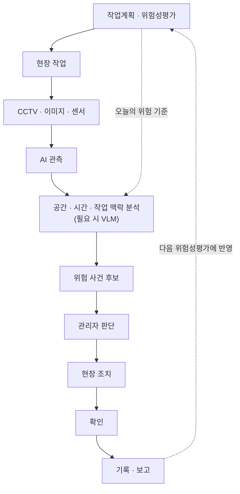

# SENTIA 프로젝트 개요

> 건설 현장의 작업계획·위험성평가와 CCTV로 관측한 실제 현장 상태를 연결하여, 안전관리자가 위험을 발견하고 판단하고 조치한 뒤 그 결과를 기록하기까지의 과정을 돕는 경량 안전 운영 플랫폼

SENTIA는 건설 현장의 안전관리 업무를 돕는 프로젝트다.
AI가 CCTV 영상에서 위험 요소를 찾으면, 그 위험이 현장의 어느 위치에서 어떤 작업 중에 발생했는지를 함께 판단해 안전관리자에게 전달한다.
안전관리자는 이 정보를 확인한 뒤 현장 조치를 요청하고, 조치 과정과 결과는 이력으로 남는다.
SENTIA의 목표는 감지 이후의 판단, 조치, 기록이 끊기지 않고 이어지는 안전 운영 흐름을 만드는 것이다.

## 배경

건설 현장에는 AI CCTV, IoT 센서, 작업자 위치 관제 같은 스마트 안전 기술이 빠르게 도입되고 있다.
대형 건설사는 이미 디지털 트윈, AI CCTV, 센서를 결합한 통합 관제를 운영하고 있으며, 상용 안전관리 플랫폼도 데이터 수집과 대시보드 통합까지 제공한다.

감지할 수 있는 위험은 늘어났지만, 현장 운영에는 여전히 공백이 남아 있다.
경보를 확인하고, 조치를 요청하고, 결과를 기록하는 일은 아직도 사람이 여러 도구를 오가며 처리한다.
따라서 SENTIA는 새로운 감지 기술을 만드는 것보다, 감지 결과가 실제 안전 업무로 이어지도록 연결하는 데 초점을 둔다.

## 문제 정의

현재 현장에서는 AI가 위험을 감지한 뒤에도 여러 단계의 수작업이 이어진다.



세션 조사에서 반복해서 확인된 문제는 다음 세 가지다.

**오탐과 맥락 부족**

단순 객체 탐지는 현장의 작업 맥락을 알지 못한다.
흙더미의 그림자를 균열로 판단하거나, 정상적으로 작업을 지휘하는 신호수를 중장비 접근 위험으로 판단하는 경우가 생긴다.
이런 오탐이 쌓이면 현장에서는 경보를 무시하거나 AI 기능을 꺼 버리게 된다.

**공간 정보 단절**

관리자는 여러 CCTV 분할 화면을 보면서, 위험이 어느 층의 어느 구역에서 발생했는지를 직접 짜맞춰야 한다.
3D·BIM 기반 관제가 이 문제를 해결할 수 있지만, 모델 변환과 좌표 정합, 초기 설정에 드는 비용 때문에 현장에서 꾸준히 활용하기 어렵다는 한계가 확인되었다.

**조치·기록 단절**

경보가 울린 뒤의 업무는 대부분 시스템 밖에서 진행된다.
영상을 되돌려 보고, 메신저로 조치를 요청하고, 결과를 엑셀이나 HWP 문서에 다시 옮겨 적는다.
감지와 조치와 기록이 서로 다른 도구에 흩어져 있기 때문에, 같은 정보를 여러 번 다루게 된다.

## 대상 사용자

SENTIA의 핵심 사용자는 **안전관리자**다.
안전관리자는 위험을 확인하고, 현장에 조치를 요청하고, 그 결과를 기록하는 업무를 맡는다.

함께 고려하는 사용자는 다음과 같다.

- **관리감독자·공사 담당자**: 당일 작업을 지휘하며, 현장 조치를 실제로 실행한다.
- **관제 운영자**: CCTV와 센서 같은 관제 장비를 운영한다.
- **작업자**: 현장에서 관측되는 대상이며, 위험을 직접 신고할 수도 있다.

## 현장 업무

안전관리자의 업무는 하루를 단위로 반복된다.

| 시점 | 주요 업무 |
|---|---|
| 작업 전 | 작업계획 확인 → 위험성평가 → TBM |
| 작업 중 | 위험 관찰 → 판단 → 조치 |
| 작업 후 | 조치 확인 → 증빙 → 기록 → 다음 위험성평가에 반영 |

TBM(작업 전 안전점검회의)은 그날 수행할 작업과 예상되는 위험을 작업자에게 전달하는 회의다.

이 흐름에서 알 수 있듯이, 안전관리자의 핵심 업무는 CCTV를 계속 지켜보는 것이 아니다.
위험을 파악하고, 판단하고, 조치하게 하고, 그 결과를 기록하는 것이 실제 업무이며, CCTV 관제는 위험을 관찰하는 여러 수단 중 하나다.

현장에서는 AI CCTV, IoT 센서, 엑셀·HWP 문서, 수기 점검표, 메신저, 공공 안전관리 시스템이 함께 쓰인다.
SENTIA는 KRAS(위험성평가 지원 시스템)나 CSI(건설공사 안전관리 종합정보망) 같은 공공 시스템을 대체하지 않는다.
그 대신 공공 시스템의 앞단에서 실제 현장 상태와 조치 이력을 정리하여, 보고에 활용할 수 있는 데이터로 만든다.

SENTIA가 주로 돕는 구간은 작업 중 위험을 관찰하는 단계부터 조치를 확인하고 증빙하는 단계까지다.

## 서비스 흐름

SENTIA는 작업계획에서 시작해 기록과 보고로 끝나는 하나의 흐름으로 동작한다.



AI의 역할은 두 단계로 나뉜다.
먼저 **AI 모델**이 영상에서 작업자, 안전모 같은 보호구, 장비를 찾아낸다.
다음으로 **AI 파이프라인**이 이 탐지 결과에 현장 위치, 지속 시간, 오늘 예정된 작업과 위험성평가 내용을 결합하여, 관리자가 실제로 확인해야 하는 위험 사건 후보를 만든다.

비전-언어 모델(VLM)은 모든 영상에 적용하지 않는다.
앞 단계에서 걸러진 후보 사건을 한 번 더 확인하거나 설명을 덧붙이는 보조 판단에 사용하는 방향으로 검토하고 있다.

최종 판단과 조치는 사람이 맡는다.
AI는 관리자가 확인해야 할 상황을 골라 주고, 관리자는 그 상황이 실제 위험인지 판단한다.

관리자가 받는 화면은 단순한 경고 문구보다 다음처럼 업무 맥락을 함께 담는 형태를 목표로 한다.

```text
B구역 · 철근 배근 · 10:24

예정 위험요인   보호구 미착용
AI 관측         작업자 #03, 안전모 미착용 7.8초 지속 (3번 카메라)

[확인]  [현장 조치 요청]
```

SENTIA는 크게 AI 모델, AI 파이프라인, 백엔드, 웹 관제 영역이 연결되는 프로젝트다.
영역별 담당과 책임 경계는 [02-team-and-roles.md](./02-team-and-roles.md)에서 다룬다.

## 핵심 특징

| 구분 | 기존 방식 | SENTIA 방향 |
|---|---|---|
| 감지 | 객체 중심 | 맥락 결합 |
| 위치 | CCTV 화면 | 현장 좌표 |
| 판단 | 개별 알람 | 위험 사건 후보 |
| 조치 | 분절된 전달 | 조치 흐름 연결 |
| 기록 | 별도 수기 | 이력 기반 초안 자동화 |

### 맥락 판단

SENTIA는 탐지 결과 하나만으로 경보를 만들지 않는다.
위험 상태가 얼마나 지속되었는지, 어느 구역에서 발생했는지, 그 구역에 오늘 어떤 작업이 예정되어 있는지를 함께 확인한다.
같은 사건이 반복해서 탐지되면 하나로 묶어서, 관리자에게 전달되는 경보의 수와 오탐을 줄인다.

### 공간·시간 상태

작업자와 장비의 위치는 CCTV 화면의 위치가 아니라 도면 위의 현장 좌표로 관리한다.
위치가 시간에 따라 어떻게 변했는지도 함께 기록하기 때문에, 위험구역 진입이나 중장비 접근처럼 대상 사이의 거리와 지속 시간이 중요한 위험을 판단할 수 있다.

### 관리자 판단

AI는 위험 사건 후보를 골라낼 뿐, 최종 판단을 내리지 않는다.
안전관리자가 후보를 확인하고, 실제 위험이라고 판단하면 현장에 조치를 요청한다.
관리자가 오탐으로 판단한 결과도 기록으로 남긴다.

### 조치·기록 연결

조치 요청, 현장 확인, 해결 확인은 하나의 사건 이력으로 이어진다.
하루 작업이 끝나면 이 이력을 바탕으로 안전일지, 조치 이력, 위험성평가 피드백의 초안을 만든다.
보고는 별도의 부가 기능이 아니라, 안전 업무 흐름의 마지막 단계로 다룬다.

## 공간 관제

관리자가 가장 먼저 알고 싶은 정보는 어느 층의 어느 구역에서, 언제, 누구에게, 어떤 위험이 발생했는지다.
이 질문에는 3D 화면이 없어도 평면도 위에서 충분히 답할 수 있으며, 경우에 따라서는 평면도가 더 빠르다.

SENTIA는 CCTV 영상 속 위치를 다음 순서로 변환하여 현장의 상황으로 만든다.

```text
CCTV 화면 좌표 → 현장 좌표 → 구역 → 작업자·장비 관계 → 시간 변화
```

실시간 관제에서는 정확한 3차원 위치 대신 층 정보와 평면 위치를 기준으로 삼는다.
위험구역 진입, 장비 접근, 체류 시간처럼 대부분의 위험 판단에는 이 정도 정보로 충분하며, 높이는 층 정보로 보충한다.

2D 화면은 평면도 위에 작업자, 장비, 위험구역, 경보를 표시한다.
2.5D 화면은 여기에 층 구분과 높이 정보를 더해서 여러 층을 한 화면에서 보여 준다.
따라서 2D·2.5D 화면은 시각 효과를 위한 장치가 아니며, 위험이 발생한 위치를 파악하고 조치를 지시하기 위한 운영 화면이다.

위치 데이터는 화면 좌표가 아닌 현장 좌표로 저장한다.
그래서 화면 표현 방식이 2D에서 2.5D나 3D로 바뀌더라도 같은 데이터를 그대로 사용할 수 있다.

## 확장 전략

SENTIA는 핵심 제품과 선택 확장을 구분한다.

```text
핵심 제품
├─ 2D 관제
├─ 2.5D 관제
├─ AI 관측
├─ 공간·시간 맥락 분석
├─ 위험 사건
└─ 조치·기록

선택 확장
├─ 3DGS    실제 현장의 최신 모습
├─ BIM     구조와 객체 정보
└─ Unreal  몰입형 3D 화면과 시뮬레이션
```

3D 가우시안 스플래팅(3DGS)은 스마트폰 등으로 현장을 주기적으로 촬영해서 실제 현장의 모습을 3D로 재현하는 기술이다.
3DGS, BIM, Unreal은 핵심 제품과 같은 위험 사건과 좌표 데이터를 받아서, 이를 더 풍부한 3D 공간으로 보여 주는 역할을 맡는다.

확장 기술이 없어도 SENTIA는 하나의 제품으로 완성되어야 한다.
확장 기술은 핵심 기능이 안정된 뒤에 추가하며, 특히 Unreal은 도입 여부를 별도로 판단한다.

## 현재 상태

| 상태 | 내용 |
|---|---|
| 방향 확정 | 안전관리자의 업무 흐름에서 출발<br>최종 판단과 조치는 관리자가 수행<br>감지 이후 조치와 기록까지 한 흐름으로 연결<br>2D·2.5D가 핵심 공간 화면이며 3DGS·BIM·Unreal은 확장<br>위치는 현장 좌표로 관리<br>실제 공사 현장을 시연의 필수 조건으로 두지 않음 |
| 논의 필요 | MVP가 보조할 업무 범위<br>핵심 시연 이벤트 3~5개 선정 (보호구 미착용, 위험구역 진입, 중장비 접근, 작업자 쓰러짐 등이 후보)<br>균열 점검 포함 여부<br>VLM 적용 범위<br>최종 시연 방식 (녹화 영상 재생, 모의 현장, 실제 현장 영상의 조합) |
| 검증 필요 | 안전관리자의 실제 하루 업무와 사용 도구<br>현직 사용자 인터뷰 가능 여부<br>핵심 이벤트별 학습·시연 데이터 확보<br>CCTV 영상을 현장 좌표로 변환하는 정확도 |
| 선택 확장 | 3DGS 현장 재현<br>BIM 연동<br>Unreal 3D 화면<br>추가 CCTV와 센서 |

이 방향이 정해지기까지의 조사와 논의 과정은 [`00-discovery/sessions/`](./00-discovery/sessions/)에 기록되어 있다.
