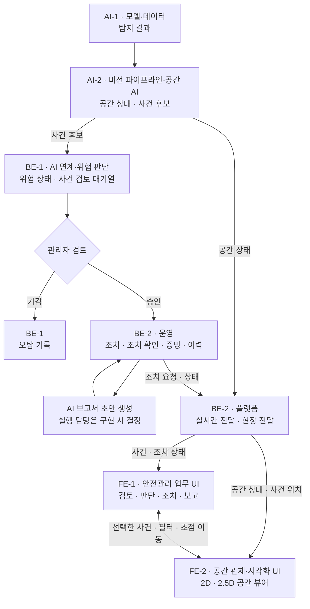

# SENTIA 팀과 역할

> 이 브랜치에서는 AI 2명, 백엔드 2명, 프런트엔드 2명으로 역할을 나누는 구조를 제안한다.
> 역할은 사용하는 기술이 아니라, 어떤 결과물의 정본을 누가 책임지는지를 기준으로 나눈다.
> 제품 방향은 [01-project-overview.md](./01-project-overview.md), 시스템 흐름은 [03-system-concept.md](./03-system-concept.md)를 따르고, 이 문서는 그 흐름을 팀 책임으로 나눈다.

## 팀 구조

| 구분 | 역할 | 핵심 책임 |
|---|---|---|
| AI-1 | 모델·데이터 | 현실에서 무엇이 보이는지 인지하는 모델과 데이터를 책임진다 |
| AI-2 | 비전 파이프라인·공간 AI | 탐지 결과를 추적하고 현장 좌표로 옮겨 공간·시간 상태와 사건 후보를 만든다 |
| BE-1 | AI 연계·위험 판단 | 사건 후보를 업무 맥락과 위험 정책에 결합해 위험 상태를 만들고, 관리자 검토 결과를 관리한다 |
| BE-2 | 운영·플랫폼 | 승인된 사건의 조치·증빙·이력·보고를 운영하고, 상태와 알림을 전달하는 공통 플랫폼을 운영한다 |
| FE-1 | 안전관리 업무 UI | 안전관리자가 사건을 검토하고 판단하고 조치하고 기록하는 업무 화면을 책임진다 |
| FE-2 | 공간 관제·시각화 UI | 2D·2.5D 공간 뷰어와 실시간 공간 표현을 책임진다 |

이 구조에는 게임 엔진이나 Unreal을 전담하는 인력이 없다.
따라서 3D 확장은 FE-2에게 자동으로 넘기지 않고, [3D 확장과 담당](#3d-확장과-담당)에서 정한 원칙을 따른다.

## 핵심 결과물

역할 사이에서 주고받는 결과물은 다음과 같다.

| 결과물 | 의미 |
|---|---|
| 탐지 결과 | AI 모델이 영상·이미지·센서에서 찾아낸 객체, 상태, 이상 징후 |
| 공간 상태 | 관측 대상의 현장 위치와 구역 등 공간 관계 |
| 사건 후보 | 시스템이 추가로 검토할 가치가 있다고 판단한 관측 |
| 위험 상태 | 사건 후보에 공간·시간·작업 맥락을 반영한 검토용 위험 수준과 우선순위 |
| 승인된 사건 | 관리자가 실제 조치가 필요하다고 승인한 사건 |
| 오탐 기록 | 관리자가 기각한 사건 후보와 그 판정 내용 |
| 조치 상태 | 승인된 사건의 조치 요청, 현장 전달, 수신 확인, 조치 확인 상태 |
| 증빙·이력 | 판단과 조치의 근거 자료와 시간순 기록 |
| AI 보고서 초안 | 이력과 증빙을 바탕으로 AI가 만든 보고서 초안 |

위 이름은 개념을 설명하는 이름이다.
실제 코드에서 사용할 이름은 구현 명세를 정할 때 결정한다.

## 역할 간 전달

아래 그림은 대표적인 안전 관제 흐름에서 각 역할이 어떤 결과물을 책임지는지 보여 준다.
실제 네트워크 호출 순서를 뜻하지는 않는다.

AI-2의 결과는 두 갈래로 나뉜다.
공간 상태는 실시간 전달을 거쳐 FE-2의 공간 뷰어로 가고, 사건 후보는 BE-1의 위험 판단과 관리자 검토를 거쳐 BE-2의 조치 흐름과 FE-1의 업무 화면으로 이어진다.
BE-2는 한 사람이 맡지만, 조치 업무를 운영하는 영역과 공통 플랫폼 영역의 책임이 다르므로 그림에서는 두 칸으로 나누어 표시한다.

FE-1과 FE-2는 서로 다른 제품을 만들지 않는다.
두 역할이 만든 화면은 하나의 SENTIA 관제 웹 애플리케이션을 이룬다.

## 역할 정의

각 역할은 같은 형식으로 설명한다.
비책임은 그 역할이 하지 않는 일이며, 다른 역할의 핵심 책임과 겹치지 않도록 정한 경계다.

### AI-1

**모델·데이터.** 프로젝트에서 필요한 현실 상태를 인지하기 위한 모델과 데이터를 책임진다.
이 역할이 답하는 질문은 "무엇이 보이는가"다.

| 항목 | 내용 |
|---|---|
| 입력 | 공개 데이터셋, 자체 수집 데이터, 오탐 사례, 라벨링 결과 |
| 책임 | 데이터 수집·정제, 라벨링 기준, 탐지 모델과 영역 분할(Segmentation) 모델, 필요한 경우 이상 징후·자세 추정·시간 흐름 모델, 미세 조정(Fine-tuning), 성능 평가, 학습된 모델 파일 관리 |
| 출력 | 학습된 모델, 탐지 결과 형식 |
| 비책임 | 객체 추적, 좌표 변환, 사건 검토 대기열, 위험 상태, 승인·기각 결과, 조치 흐름, 화면 |

현재 가장 구체적으로 논의된 대상은 작업자, 보호구, 장비 탐지다.
균열이나 구조 결함처럼 다른 관측 대상을 선택하면 영역 분할 같은 다른 모델이 필요할 수 있으며, 관측 대상은 04에서 정한다.

### AI-2

**비전 파이프라인·공간 AI.** 모델이 인지한 결과를 추적·공간·시간 상태와 사건 후보로 바꾸고, 느린 AI 작업을 실시간 처리와 분리해 운영한다.
이 역할이 답하는 질문은 "AI가 인지한 현실을 어떤 공간·시간 상태와 사건 후보로 만들 것인가"다.

| 항목 | 내용 |
|---|---|
| 입력 | 카메라 영상(RTSP), 녹화 재생 영상, 점검 이미지, AI-1의 탐지 결과, 카메라 보정 정보, 백엔드가 제공하는 현장·작업 맥락 |
| 책임 | 추론 실행 환경, 객체 추적, 카메라 보정(Calibration), 호모그래피(Homography)를 이용한 화면 좌표에서 현장 좌표로의 변환, 구역 포함 여부·이동 경로·거리·지속 시간 계산, 공간·시간 상태, 후보 선별과 사건 후보 생성, VLM을 이용한 맥락 확인, 느린 AI 작업의 대기열 처리 |
| 출력 | 공간 상태, 사건 후보, VLM 확인 결과 |
| 비책임 | 작업계획·위험성평가 정본, 우선순위 정책, 승인·기각 결과, 조치 흐름, 보고서 확정, 화면에서 공간을 그리는 일 |

모든 입력에 객체 추적과 호모그래피를 적용하지는 않는다.

| 입력 | 가능한 처리 |
|---|---|
| 동적 영상 | 탐지 → 추적 → 공간·시간 상태 |
| 점검 이미지 | 탐지·영역 분할 → 결함 위치와 구조물 연결 |
| 센서·장비 운행 정보 | 시간 맞춤 → 상태 결합 |
| 현장 재현 촬영 | 현장 좌표와 촬영 시점 연결 |

VLM은 모든 영상 프레임을 처리하지 않고, 사건 후보처럼 추가 확인이 필요한 경우에만 실시간 처리와 분리해서 실행한다.

AI-2의 책임은 카메라 화면의 픽셀을 현장 좌표로 옮기는 데까지다.
공간 상태의 계산 정본은 AI-2가 가지며, 이 상태를 화면에 그리는 일은 FE-2가 맡는다.
FE-1과 FE-2는 AI 실행 환경에 직접 연결하지 않고, BE-2의 실시간 전달을 통해 공간 상태를 받는다.

### BE-1

**AI 연계·위험 판단.** 사건 후보를 현장 업무와 위험 정책에 결합해 관리자가 검토할 위험 상태로 만들고, 승인·기각 결과를 공식 상태로 정리한다.
이 역할이 답하는 질문은 "AI가 본 상황이 실제 안전관리 업무에서 무엇을 의미하는가"다.

| 항목 | 내용 |
|---|---|
| 입력 | 사건 후보, VLM 확인 결과, 공간 상태, 작업계획, 위험성평가, 현장·층·구역 정보, 현장 정책 |
| 책임 | 사건 후보 수신, 작업·위험성평가 맥락 결합, 후보 검증과 중복 제거, 위험 정책, 우선순위와 위험 상태, 사건 검토 대기열의 업무 상태, 관리자 검토 결과 반영, 오탐 기록 |
| 출력 | 승인하면 승인된 사건, 기각하면 오탐 기록 |
| 비책임 | 비전 알고리즘, AI 모델 실행, 승인 이후의 조치 흐름, 공통 전달 기반, 화면 |

사건 후보에서 승인된 사건까지는 세 주체가 판단을 나눠 맡는다.

| 주체 | 판단 |
|---|---|
| AI-2 | 검토할 가치가 있는 사건 후보인가 |
| BE-1 | 업무 맥락상 무엇을 먼저 검토해야 하는가 |
| 관리자 | 실제로 조치할 사건인가 |

따라서 한 번의 탐지 결과가 곧바로 승인된 사건이 되지 않는다.
대표적인 안전 관제에서는 승인 결과를 승인된 안전 사건으로 다룬다.
구조 결함, 환경 이상, 공정 변화는 별도의 사건 유형이 될 수 있으며, 유형 구분은 03에서 계속 논의한다.

백엔드가 2명이 되더라도 BE-1은 AI와 직접 맞닿는 백엔드로 유지하며, 일반적인 데이터 관리 백엔드에 흡수하지 않는다.

### BE-2

**운영·플랫폼.** 승인된 사건을 실제 현장 조치, 조치 확인, 증빙, 이력, 보고까지 운영하고, 다른 역할이 만든 상태와 조치 요청을 사용자와 현장 수신 단말에 안정적으로 전달하는 공통 실행 기반을 책임진다.

여기서 운영은 승인 이후의 안전 조치 업무를 운영한다는 뜻이고, 플랫폼은 모든 역할이 함께 쓰는 실행 기반을 뜻한다.
두 영역은 한 사람이 맡지만, 정본과 책임은 구분해서 관리한다.

| 항목 | 내용 |
|---|---|
| 입력 | 승인된 사건, 관리자의 조치 요청, 현장의 수신 확인과 조치 결과, 증빙, 다른 역할이 전달을 요청한 상태 |
| 운영 책임 | 조치 생성, 조치 담당자 지정, 현장 전달 요청, 수신 확인, 조치 확인, 증빙 정보, 사건·조치 이력, 시간순 기록, 보고서 생성에 쓸 구조화 업무 데이터, 보고서 초안의 검토·확정 상태, 위험성평가 반영 자료 |
| 플랫폼 책임 | 인증, 사용자, 권한, 공통 API 기반, PostgreSQL, Redis, WebSocket·STOMP 실시간 전달, 알림과 현장 전달 경로, 파일 저장소, Docker, Nginx, 자동 빌드·배포, 로그, 상태 점검, 모니터링 |
| 출력 | 조치 상태, 조치 확인 결과, 증빙·이력, 보고서 생성용 정보, 보고서 검토 상태, 공통 API, 실시간 전달, 현장 전달 기반, 배포 환경 |
| 비책임 | 탐지, 객체 추적, 사건 후보 생성, 공간 상태 계산, 위험 정책, 화면 |

백엔드 인원이 줄어도 관리자 판단 이후의 흐름은 줄이지 않는다.
조치 요청, 현장 전달, 수신 확인, 조치 확인, 증빙, 이력, 보고로 이어지는 흐름은 그대로 BE-2가 책임진다.

BE-2는 보고서 문장을 직접 만드는 역할이 아니다.
보고서의 근거가 되는 업무 데이터와, 어떤 초안이 유효하고 누가 검토·확정했는지를 책임진다.
AI 보고서 생성을 실제로 어디에서 누가 실행할지는 구현 범위를 정할 때 결정한다.

플랫폼 영역은 상태의 의미를 만들거나 바꾸지 않고 전달한다.
예를 들어 운영 영역에서 "작업자 A에게 조치 요청 17번을 전달한다"고 결정하면, 플랫폼 영역은 웹, 모바일, 스마트워치, 푸시 알림 가운데 선택된 경로로 이를 전달한다.
실제 전달 경로는 04에서 정한다.

BE-2는 업무 흐름의 후반부와 공통 기반을 함께 맡기 때문에 팀에서 부담이 가장 몰리기 쉬운 역할이다.
그래서 플랫폼 영역은 핵심 시연 흐름을 안정적으로 실행하는 수준에서 시작하고, Kafka·Kubernetes처럼 운영 규모를 키우는 기술은 계속 조건부로 둔다.

### FE-1

**안전관리 업무 UI.** 안전관리자가 사건을 검토하고, 승인·기각하고, 조치를 요청하고, 결과를 기록하는 업무 흐름을 화면으로 책임진다.
이 역할이 답하는 질문은 "안전관리자가 어떤 순서로 보고, 판단하고, 조치하고, 기록하는가"다.

FE-1은 단순히 데이터를 입력하고 조회하는 화면을 만드는 역할이 아니다.
AI가 고른 후보를 사람이 판단하고 조치로 이어 가는 SENTIA의 사람 중심 검토 흐름(Human-in-the-loop)을 사용자 경험으로 완성한다.

| 항목 | 내용 |
|---|---|
| 입력 | 위험 상태, 사건 검토 대기열, 승인된 사건, 조치 상태, 증빙·이력, AI 보고서 초안, FE-2가 알리는 공간 선택 |
| 책임 | 애플리케이션 셸(App Shell), 라우팅, 공통 레이아웃, 사건 검토 대기열과 우선순위 표시, 사건 상세와 판단 근거 표시, 승인·기각 화면, 조치 요청과 조치 상태 화면, 조치 확인·증빙 화면, 시간순 이력, AI 보고서 초안 검토·수정 화면, 실시간 업무 상태 반영 |
| 출력 | 안전관리 업무 화면, 관리자 입력 |
| 비책임 | 도면·2.5D 공간 표현, 거리·구역 계산, 위험 정책, 공식 상태를 화면에서 임의로 바꾸는 일 |

FE-1은 판단 로직을 따로 복사해서 가지지 않는다.
화면에 필요한 값은 백엔드 API와 BE-2의 실시간 전달로 받고, 관리자의 조작은 요청으로 백엔드에 보낸다.
현장 작업자를 위한 가벼운 수신 화면도 제품 방향에 포함되며, 이를 스마트워치 전용 앱으로 만들지 모바일이나 웹으로 검증할지는 04에서 정한다.

### FE-2

**공간 관제·시각화 UI.** AI-2가 계산한 현장 공간 상태를 도면 기반 2D·2.5D 화면으로 표현하고, 안전관리자가 공간 위에서 상황을 빠르게 이해하도록 돕는다.
이 역할이 답하는 질문은 "AI-2가 계산한 현장 공간 상태를 안전관리자가 어떻게 빠르게 이해할 것인가"다.

FE-2는 별도의 엔진 개발자가 아니라, 브라우저에서 동작하는 공간 화면을 책임지는 프런트엔드 역할이다.

| 항목 | 내용 |
|---|---|
| 입력 | 공간 상태, 사건 후보와 승인된 사건의 위치, 도면, 현장·층·구역 정보, 카메라 위치와 촬영 범위, FE-1이 알리는 업무 선택과 필터 |
| 책임 | 2D 도면 뷰어, 도면 레이어, 층·구역·카메라·카메라 촬영 범위(FOV)·작업자·장비 표시, 사건 위치와 위험구역 표시, 실시간 공간 상태 표현, 확대·이동(Pan/Zoom), 공간 선택과 강조 표시, 2.5D 화면, Three.js 기반 공간 객체 상호작용, 뷰어 성능 |
| 출력 | 2D·2.5D 공간 뷰어, 공간 선택 |
| 비책임 | 카메라 보정 계산, 호모그래피 계산, 화면 좌표에서 현장 좌표로의 변환, 구역 포함 여부 판정, 실제 거리 계산, 객체 추적, 위험 판단 |

좌표와 관련된 책임은 다음과 같이 나눈다.

| 역할 | 좌표 책임 |
|---|---|
| AI-2 | 카메라 화면의 픽셀을 현장 좌표로 옮긴다 |
| FE-2 | 현장 좌표를 화면이나 2.5D 장면 위의 위치로 옮긴다 |

FE-2는 AI-2의 계산을 화면에서 다시 구현하지 않는다.
공간 계산의 정본은 AI-2에 있으며, FE-2는 백엔드가 전달한 공간 상태를 표현한다.

### FE-1과 FE-2의 경계

FE-1은 업무 흐름을, FE-2는 공간 흐름을 책임진다.
두 화면은 같은 사건 식별자와 선택 상태를 공유하며, 대표적인 상호작용은 다음과 같다.

| 사용자 조작 | 화면 반응 |
|---|---|
| FE-2 도면에서 사건을 선택한다 | FE-1이 사건 상세와 검토 패널을 연다 |
| FE-1 검토 대기열에서 사건을 선택한다 | FE-2가 해당 층·구역·객체로 초점을 이동한다 |
| FE-1에서 필터를 바꾼다 | FE-2의 공간 레이어에 같은 필터가 반영된다 |
| FE-2에서 구역을 선택한다 | FE-1이 해당 구역의 사건 목록을 갱신한다 |

이 선택·필터·초점 이동의 형식은 구현 초기에 두 역할이 합의한다.

두 역할은 React, TypeScript, 공통 컴포넌트, 디자인 토큰, API 클라이언트, 실시간 클라이언트, 공통 상태 관리, 오류·로딩 화면 처리를 함께 사용한다.
다만 정본 책임은 겹치지 않게 나눈다.

| 역할 | 주로 소유하는 영역 |
|---|---|
| FE-1 | 애플리케이션 셸, 업무 상태, 업무 컴포넌트 |
| FE-2 | 공간 뷰어, 뷰어 상태, 공간 컴포넌트 |

공용 코드를 최종적으로 누가 소유할지는 구현 초기에 합의한다.

## 3D 확장과 담당

이 구조에는 게임 엔진이나 Unreal을 전담하는 인력이 없다.
FE-2의 기본 책임은 2D·2.5D 공간 관제이며, 3D 확장은 기본 책임에 포함하지 않는다.
3DGS, BIM 고도화, Unreal은 모두 조건부 확장이지만, 구현 방식과 필요한 인력이 다르므로 다음과 같이 따로 다룬다.

| 확장 | 원칙 | 담당 |
|---|---|---|
| 3DGS | 브라우저 뷰어로 검증할 수 있고 핵심 제품이 안정적이면, FE-2가 중심이 되고 AI-2가 좌표와 현장 재현 데이터를 맡는 형태로 기술 검증을 검토할 수 있다 | 조건부, 구현 방식 결정 후 관련 역할 |
| BIM 고도화 | FE-2가 웹 기반 Three.js·IFC 뷰어 수준으로 접근할 수 있지만 핵심 제품 범위는 아니다 | 조건부, 구현 방식 결정 후 관련 역할 |
| Unreal | 이번 인력 구조에서는 기본적으로 착수하지 않는다 | 조건부, 현재 담당 없음 |

Unreal은 다음 조건을 모두 충족할 때만 다시 검토하며, 그 전에는 시작하지 않는다.

- 핵심 제품이 일찍 안정되었다
- FE-2나 다른 팀원이 Unreal을 실제로 수행할 수 있음을 확인했다
- 04의 확장 여부 관문을 통과했다

## 정본 책임

하나의 결과물은 하나의 역할만 정본으로 가진다.

| 역할 | 정본 |
|---|---|
| AI-1 | 학습된 모델과 탐지 결과 형식 |
| AI-2 | 공간 상태, 사건 후보의 AI 근거, VLM 확인 결과 |
| BE-1 | 사건 검토 대기열의 업무 상태, 우선순위와 위험 상태, 승인·기각 결과 |
| BE-2 | 조치 상태, 조치 확인 결과, 증빙 정보, 이력, 보고서 초안의 검토·확정 상태, 전달·연결 상태와 공통 운영 기반 |
| FE-1 | 안전관리 업무 화면의 표현 상태 |
| FE-2 | 공간 뷰어의 표현 상태 |

FE-2가 가지는 정본은 공간을 어떻게 보여 주는지에 대한 표현 상태이며, 공간 상태 자체의 정본은 AI-2에 있다.

작업계획, 위험성평가, 현장 정책 같은 업무 맥락의 정본은 백엔드가 가진다.
AI는 이 맥락을 받아서 관측을 해석하는 데 사용할 뿐, 새로 만들거나 수정하지 않는다.

| 방향 | 전달 내용 |
|---|---|
| 백엔드 → AI | 현장·층·구역, 카메라, 카메라 보정 버전, 진행 중인 작업, 위험성평가 맥락 |
| AI → 백엔드 | 공간 상태, 사건 후보, 증빙 참조, 탐지 신뢰도, VLM 확인 결과 |

## 실행 환경

실행 환경은 AI 실행 환경, 공통 플랫폼, 웹 클라이언트로 나눈다.
별도의 게임 엔진 실행 환경은 두지 않는다.

| 구분 | 주 담당 | 범위 |
|---|---|---|
| AI 실행 환경 | AI-2 | 추론 작업, 현장 가까운 곳에서의 1차 처리 후보, GPU·CUDA, 모델 불러오기, 카메라 영상 수신, VLM 작업, 느린 AI 작업 대기열, AI 처리 속도·지연·GPU 메모리 지표 |
| 공통 플랫폼 | BE-2 | Spring Boot 실행 환경, PostgreSQL·Redis, 실시간 전달과 알림, 파일 저장소, Docker Compose, Nginx·TLS, 자동 빌드·배포, 로그, 모니터링 |
| 웹 클라이언트 | FE-1, FE-2 | 하나의 관제 웹 애플리케이션이며, FE-1은 업무 화면을, FE-2는 Canvas·Three.js 공간 뷰어를 맡는다 |

AI-2가 AI 지표의 의미를 정하고, BE-2가 지표를 모아 저장하고 보여 주는 기반을 제공한다.
AI 보고서 생성을 어느 실행 환경에서 처리할지는 구현 범위를 정할 때 결정한다.

## 기술 축

기본 기술축은 다음과 같다.

| 영역 | 기본 기술 |
|---|---|
| AI | Python, PyTorch, YOLO, OpenCV |
| 백엔드 | Java, Spring Boot, PostgreSQL, Redis |
| 프런트엔드 | React, TypeScript |
| 공간 프런트엔드 | Canvas, SVG, Three.js |
| 실행 환경 | Docker, Nginx, 필요한 경우 GPU·CUDA |

필요가 확인되면 다음 기술을 추가로 선택할 수 있다.

- ByteTrack, BoT-SORT, 객체 재식별(ReID)
- FastAPI
- Celery 등 Redis 기반 작업 대기열
- ONNX, TensorRT
- PostGIS
- 3DGS, BIM(IFC)
- Unreal
- Kafka, Kubernetes
- 스마트워치 전용 앱

기술 목록이 제품 범위를 정하지는 않는다.

## 역할 부담

기능을 추가하면 다음 역할의 부담이 늘어날 수 있다.

| 범위 변화 | 부담이 늘어나는 역할 |
|---|---|
| 관측 대상·모델 추가 | AI-1 |
| 추적, 좌표, 공간 계산, VLM 추가 | AI-2 |
| 위험 정책과 검토 기준 확대 | BE-1 |
| 조치, 증빙, 이력, 보고 업무 확대 | BE-2 |
| 실시간 전달, 알림, 공통 플랫폼 확대 | BE-2 |
| 검토, 조치, 보고 업무 화면 확대 | FE-1 |
| 도면 관제, 공간 레이어, 2.5D 확대 | FE-2 |
| 3DGS·BIM | 조건부, 구현 방식 결정 후 관련 역할 |
| Unreal | 조건부, 현재 담당 없음 |
| AI 보고서 생성 방식·모델·실행 구조 확대 | 실행 담당 결정 후 해당 역할 |

BE-2는 조치 업무와 공통 플랫폼의 부담을 함께 받으므로, 범위를 정할 때 가장 먼저 점검한다.
한 역할에 부담이 몰리면 역할을 넘기기보다 04에서 범위를 줄이는 근거로 사용한다.

## 현재 상태

| 상태 | 내용 |
|---|---|
| 유지하는 방향 | 탐지 결과와 사건 후보 분리 AI와 직접 맞닿는 백엔드(BE-1) 유지 관리자 승인·기각 승인 후 조치, 조치 확인, 증빙, 보고 연결 AI 실행 환경과 공통 플랫폼 분리 실시간 처리와 느린 AI 작업 분리 |
| 역할 구조 제안 | AI 2 / BE 2 / FE 2 구조 BE-2가 운영과 공통 플랫폼을 함께 담당 FE-1 업무 화면과 FE-2 공간 뷰어 분리 좌표 경계: AI-2는 픽셀에서 현장 좌표까지, FE-2는 현장 좌표에서 화면까지 2D·2.5D 공간 관제는 FE-2의 기본 책임 |
| 팀 합의 필요 | 핵심 사건 종류 검토 화면의 구현 깊이 현장 수신 단말의 구현 형태와 담당 보고서 종류와 서식 AI 보고서 생성의 실행 위치와 담당 VLM을 적용할 사건 2.5D 구현 깊이 FE-1과 FE-2가 주고받는 선택·필터·초점 이동 형식 FE 공용 코드의 소유 방식 |
| 조건부 | 3DGS·BIM 고도화(구현 방식 결정 후 담당 배정) Unreal(현재 담당 없음) 다중 카메라·객체 재식별 열화상·장비 운행 정보·착용형 센서 Kafka·Kubernetes |

이 구조는 팀 합의를 거쳐 병합할 때 확정 표현으로 바꾼다.
구체적인 구현 범위와 일정은 [04-scope-and-plan.md](./04-scope-and-plan.md)에서 정한다.
