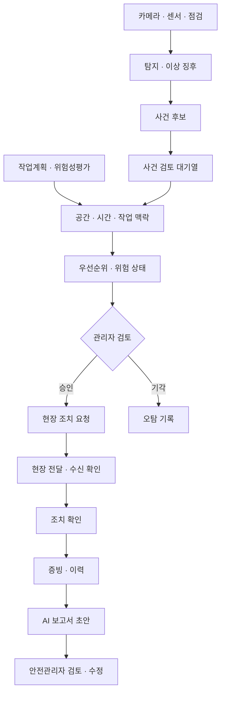
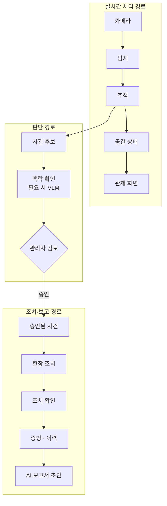

# SENTIA 시스템 개념

> SENTIA는 건설 현장에서 관측한 정보를 공간·시간·작업 맥락과 결합해 사건 후보를 만들고, 관리자가 승인하거나 기각한 뒤 현장 조치, 조치 확인, 기록, AI 보고서까지 이어 주는 안전 운영 시스템이다.
> 이 문서는 시스템 안에서 정보와 상태가 어떻게 흐르는지를 설명하는 대표 문서다.
> 역할별 책임은 [02-team-and-roles.md](./02-team-and-roles.md), 이번 프로젝트에서 실제로 구현할 범위는 [04-scope-and-plan.md](./04-scope-and-plan.md)를 따른다.

## 시스템 개요

SENTIA는 세 가지 처리 경로로 동작하며, 각 경로가 하나의 핵심 문제에 대응한다.

| 처리 경로 | 하는 일 | 대응하는 핵심 문제 |
|---|---|---|
| 실시간 처리 경로 | 현재 현장 상태를 계속 갱신해 관제 화면에 보여 준다 | 공간 정보 단절 |
| 판단 경로 | 사건 후보를 맥락으로 보강하고, 관리자가 승인하거나 기각한다 | 오탐과 맥락 부족 |
| 조치·보고 경로 | 승인된 사건을 현장 조치, 조치 확인, 증빙, AI 보고서 초안으로 이어 준다 | 조치와 기록 단절 |

## 전체 흐름

다음 그림은 SENTIA의 대표 흐름이다.
특정 API의 호출 순서가 아니라, 어떤 정보가 어떤 판단을 거치는지를 나타낸다.

## 업무 맥락

다음 정보는 AI가 만드는 값이 아니라 현장 업무의 정본이며, 백엔드가 관리한다.

- 작업계획, 공종, 작업 위치, 인원과 장비
- 위험성평가와 TBM(작업 전 안전점검회의) 내용
- 현장·층·구역 정보
- 카메라와 카메라 보정 버전

AI는 필요한 범위에서 이 정보를 읽어 관측을 해석한다.
같은 탐지 결과라도 어느 구역인지, 어떤 작업 중인지, 얼마나 지속되었는지, 주변에 어떤 장비가 있는지, 오늘 위험성평가에 포함된 위험인지에 따라 의미가 달라진다.

## 현실 입력

SENTIA는 CCTV 한 종류만을 전제로 하지 않는다.

| 입력 계열 | 예시 | 용도 |
|---|---|---|
| 영상 | CCTV, 녹화 영상 | 작업자, 보호구, 장비, 행동, 실시간 상태 |
| 이미지 | 점검 사진, 스마트폰, DSLR, 드론 | 균열, 구조물 손상, 근접 점검 |
| 센서 | 환경 센서, 열화상 카메라, GPS, 장비 운행 정보, 착용형 센서 | 환경, 장비 위치와 가동, 행동 보조 |
| 공간 | 도면, CAD, BIM·IFC, 기준점 | 층·구역 등 공간 기준 |
| 현장 재현 | 스마트폰 촬영, 360 카메라, 포인트 클라우드, 3DGS | 주기적인 현장 모습과 변화 |
| 가상 입력 | 녹화 재생, 시뮬레이션, 합성 데이터 | 개발, 검증, 시연, 드문 사건 보강 |

이 표는 가능한 입력의 후보이며, 실제로 사용할 입력은 04에서 정한다.

## 현실 입력 연결

입력의 종류와 이후 처리 구조는 가능한 한 분리한다.
현실 입력 연결 계층(Reality Interface)은 서로 다른 입력을 수집하고, 형식을 맞추고, 시간을 맞추고, 검증하고, 현장 공간과 연결해 표준화된 관측 정보로 바꾼다.

녹화 재생과 모의 현장(Testbed)은 실제 공사 현장을 대신하는 임시방편이 아니다.
실시간 영상, 녹화 영상, 모의 현장 영상을 같은 처리 구조에 넣어 반복해서 검증하기 위한 입력 전략이다.

## 관측 처리

현실 입력은 성격에 따라 처리 방식이 다르다.

| 계열 | 대표 대상 | 처리 흐름 |
|---|---|---|
| 동적 관측 | 작업자, 보호구, 장비, 위험구역 | 영상 → 탐지 → 추적 → 공간·시간 상태 → 사건 후보 |
| 구조 점검 | 균열, 박락, 누수, 구조 결함 | 점검 이미지 → 탐지·영역 분할 → 결함 분석 → 사건 후보 |
| 환경 관측 | 화재, 연기, 과열, 가스 | 영상·열화상·센서 → 상태·이상 징후 분석 → 사건 후보 |
| 현장 변화 | 공정, 현장 모습 변화 | 주기적 촬영 → 현장 재현 처리 → 시점별 스냅샷 → 변화 비교 |

어떤 계열을 핵심 제품에 넣을지는 이 문서에서 정하지 않는다.

## 처리 경로

세 처리 경로는 서로 다른 속도로 동작하며, 느린 경로가 빠른 경로를 막지 않도록 분리한다.

현장 가까운 곳에서 1차 탐지와 추적을 빠르게 처리하고, VLM 분석과 보고서 생성처럼 무거운 작업은 사건 후보에 한해 별도로 처리하는 방향을 지향한다.
이렇게 하면 실시간 처리의 지연과 전송 부담을 줄이고, 무거운 작업이 객체 추적을 막지 않는다.
현장 장비와 배포 위치는 04에서 기술 검증 대상으로 다룬다.

### 실시간 처리

실시간 처리 경로는 현재 현장 상태를 유지한다.
흐름은 카메라 → 탐지 → 추적 → 공간·시간 상태 → 실시간 전달 → 관제 화면 순서다.

실시간 상태에는 필요에 따라 작업자와 장비의 현재 위치, 추적 대상, 구역 포함 여부, 거리, 속도, 체류 시간, 보호구 착용 상태, 카메라 상태가 들어갈 수 있다.
이 경로의 기준은 대기열이 아니라 공간 상태이며, VLM 분석, 관리자 검토, 보고서 생성이 느려져도 계속 동작해야 한다.

### 판단 처리

탐지 결과 하나가 바로 경보나 공식 사건이 되지 않는다.
탐지 결과는 지속 시간, 공간 조건, 중복 여부를 거쳐 추가 검토할 가치가 있을 때만 **사건 후보**가 된다.

사건 후보는 **사건 검토 대기열**에서 관리된다.
사건 검토 대기열은 당장 높은 경보를 울리는 목록이 아니라, 시스템과 관리자가 추가로 판단해야 할 후보가 모인 논리적인 대기열이다.
특정 Redis 목록이나 메시지 큐를 뜻하지 않는다.

사건 후보는 다음 정보를 결합해 관리자에게 보여 줄 **우선순위와 위험 상태**로 정리된다.

- 공간 위치와 구역
- 지속 시간
- 작업자와 장비의 관계
- 현재 공종과 위험성평가
- AI 탐지 신뢰도
- 필요한 경우 VLM 확인 결과
- 같은 후보의 반복 여부

정확한 우선순위 계산 방식과 심각도 기준은 구현 범위에서 정한다.

### 승인과 기각

관리자 검토는 오탐을 막는 핵심 관문이다.
관리자가 승인한 후보는 **승인된 사건**이 되어 현장 조치로 이어지고, 기각한 후보는 **오탐 기록**으로 남고 현장에 전달되지 않는다.
따라서 탐지와 실제 현장 알림 사이에는 항상 사람의 판단이 있다.

오탐 기록은 운영 통계와 판단 기준 개선의 근거로 사용한다.
오탐 사례를 모델 학습에 다시 활용할지, 재학습을 자동화할지는 별도로 결정한다.

대표적인 안전 관제에서는 승인 결과를 승인된 안전 사건으로 다룬다.
구조 결함, 환경 이상, 공정 변화는 별도의 사건 유형이 될 수 있으며, 공통 유형과 세부 유형은 제품 범위가 정해진 뒤 결정한다.

### VLM 활용

VLM은 모든 프레임을 판정하는 주 경로가 아니다.
1차 탐지와 상태 조건으로 사건 후보를 고른 뒤, 필요한 후보에 대해서만 VLM으로 작업 맥락을 추가로 확인하거나 설명을 덧붙인다.
VLM이 실패하거나 느려져도 실시간 처리는 유지된다.
실제 모델, 적용 사건, 제한 시간, 실패 시 대체 방법은 04에서 검증한다.

## 조치와 보고

### 현장 조치

관리자가 승인한 사건은 시스템 안의 기록으로 끝나지 않고 현장 조치로 이어진다.
흐름은 승인 → 조치 요청 → 현장 전달 → 수신 확인 → 실제 조치 → 완료·증빙 → 조치 확인 순서다.

조치 요청은 현장 담당자의 수신 단말(Endpoint)로 전달된다.
제품 방향에서는 안전관리자와 작업자가 작업 중에도 쉽게 확인할 수 있는 스마트워치를 목표 단말로 둔다.
이번 프로젝트에서 스마트워치 전용 앱, 모바일, 웹, 모의 수신 단말 가운데 무엇을 사용할지는 04에서 정한다.
중요한 점은 현장 전달과 응답 경로가 제품 구조 안에 있어야 한다는 것이다.

### 증빙과 이력

조치 과정에서 다음 내용을 구조화해 남긴다.

- 누가 판단했는가
- 누가 조치 요청을 받았고 언제 수신을 확인했는가
- 무엇을 조치했고 언제 확인되었는가
- 어떤 사진, 영상, 문서가 증빙인가
- 오탐은 몇 건이었는가

이 기록이 보고서 작성의 근거가 된다.

### AI 보고서

보고서는 업무 흐름의 마지막 단계다.
승인된 사건, 조치, 조치 확인, 증빙, 이력을 모아 보고서 생성용 정보로 정리하고, AI가 이를 바탕으로 보고서 초안을 만든다.
안전관리자는 초안을 검토하고 수정한 뒤 업무 문서로 확정한다.

활용할 수 있는 보고서는 일일 안전일지, 시정조치 이력, 아차사고 기록, 안전업무 보고, 위험성평가 반영 자료 등이다.
AI 보고서 초안은 법적 판단이나 공식 결재를 대신하지 않는다.
보고서 생성은 느린 작업으로 따로 처리해 실시간 관제를 막지 않으며, 실행 위치와 담당은 구현 범위를 정할 때 결정한다.

## 공간 모델

공간 상태는 화면 표현과 독립적으로 관리한다.
정본은 화면 픽셀이 아니라 현장 공간 기준이다.

| 좌표 | 의미 |
|---|---|
| 화면 좌표 | 관제 화면에 표시하기 위한 좌표 |
| 도면 좌표 | 도면 위의 위치 |
| 현장 좌표 | 현장을 기준으로 한 실제 위치 |
| 외부 기준 좌표 | 프로젝트 전체 또는 외부 공간과 맞추기 위한 좌표 |

외부 기준 좌표를 반드시 위도·경도나 특정 지리 좌표로 정하지는 않는다.

현장·층·구역, 카메라, 작업자, 장비, 사건 후보, 승인된 사건, 결함, 센서, 현장 스냅샷은 같은 공간 기준을 공유할 수 있다.
그래서 Canvas, Three.js, Unreal 같은 표현 방식이 서로 데이터를 변환할 필요 없이 같은 공간 상태를 각자의 방식으로 보여 줄 수 있다.

## 시간 모델

SENTIA에는 여러 시간축이 있다.

| 시간축 | 흐름 |
|---|---|
| 실시간 | 프레임 → 추적 대상 → 몇 초간 지속되는 상태 → 사건 후보 → 관리자 검토 → 조치 |
| 업무 | 작업계획 → 작업 시간대 → 조치 → 조치 확인 → 하루 이력 |
| 주기 점검·현장 재현 | 1차 촬영 → 2차 촬영 → 3차 촬영 순으로 쌓이는 시점별 스냅샷 |

정확한 저장 구조와 보존 기간은 이후 설계한다.

## 대기열과 적체

처리 속도가 다른 작업이 섞여 있으므로, 우선순위는 다음 순서로 둔다.

카메라 영상·객체 추적 > 사건 후보 처리 > VLM 맥락 확인 > 보고서 생성

대기열은 목적에 따라 나눈다.

| 대기열 | 목적 |
|---|---|
| 사건 검토 대기열 | 관리자가 검토할 사건 후보의 업무 상태를 관리한다 |
| 느린 AI 작업 대기열 | VLM 분석, 이미지 분석, 보고서 생성처럼 오래 걸리는 AI 작업을 처리한다 |
| 전달 대기 처리 | 알림과 조치 요청을 현장 수신 단말에 안정적으로 전달한다 |

각 대기열의 담당은 02를 따른다.
작업이 쌓이는 것 자체가 곧 장애는 아니다.
보고서 생성이 늦어져도 실시간 관제는 정상일 수 있지만, 카메라 프레임 지연이 커지면 실시간 관제 품질에 문제가 생긴다.

처리 적체를 제어하기 위해 다음 지표를 관찰한다.

- 대기 작업 수와 가장 오래 기다린 작업의 대기 시간
- 추론 처리 지연과 카메라 프레임 지연
- GPU 사용량과 GPU 메모리
- 맥락 확인·VLM 처리 지연
- 현장 전달 실패율
- 보고서 생성 적체

구체적인 대기열 기술과 동시 처리 방식은 구현 설계에서 정한다.

## 저장 원칙

모든 AI 결과를 영구히 저장하지는 않는다.

| 대상 | 저장 방향 |
|---|---|
| 원본 영상 프레임과 탐지 결과 | 단기 보관 또는 선택 저장 |
| 공간 상태 | 최신 상태 중심 |
| 사건 후보 | 검토에 필요한 범위에서 저장 |
| 승인된 사건 | 공식 사건으로 저장 |
| 오탐 기록 | 검토 결과와 품질 통계의 근거로 저장 |
| 조치와 조치 확인 | 업무 이력으로 저장 |
| 증빙 | 사건과 조치의 근거로 저장 |
| 보고서 초안과 확정본 | 업무 문서 상태로 저장 |

정확한 보존 기간과 파일 저장 구조는 이후에 정한다.

## 표현 계층

같은 상태를 여러 표현 방식으로 보여 줄 수 있다.

| 표현 방식 | 역할 |
|---|---|
| Canvas / SVG | 2D 관제 |
| Three.js | 2.5D·경량 3D |
| 3DGS | 실제 현장 모습 재현 |
| BIM / 3D 메시 | 구조·형상·객체 정보 |
| Unreal | 고도화된 3D 관제와 시뮬레이션 |

2D·2.5D는 현장 위치와 상황을 빠르게 파악하기 위한 기본 방향이다.
3DGS는 실제 현장 모습을 주기적으로 연결하는 방향이며, CCTV의 실시간 관측을 대신하지 않는다.

| 입력 | 성격 |
|---|---|
| 고정 CCTV | 계속 이어지는 현재 상태 |
| 주기적 현장 재현 촬영 | 시점별 현장 스냅샷 |

실제 구현 여부는 04에서 정한다.

## 현재 상태

| 상태 | 내용 |
|---|---|
| 방향 확정 | 실시간 처리, 판단, 조치·보고 경로 분리 탐지 결과와 공식 사건 분리 사건 검토 대기열을 통한 추가 판단 관리자 승인·기각 공간 상태를 현장 좌표 기준으로 관리 승인 후 현장 조치 전달, 수신 확인, 조치 확인 연결 이력과 증빙 기반 AI 보고서 초안 최종 판단과 보고서 확정은 사람이 한다 |
| 팀 합의 필요 | 핵심 관측 대상과 사건 우선순위와 위험 상태의 세부 기준 사건 유형 구분 현장 수신 단말의 구현 형태 보고서 종류와 서식 AI 보고서 생성의 실행 위치 VLM 실제 적용 범위 2D·2.5D 구현 깊이 |
| 검증 필요 | 모델 성능과 오탐 수준 객체 추적과 카메라 보정 품질 대기열 처리 지연과 적체 현장 전달 신뢰성 AI 보고서 초안 품질 녹화 재생, 모의 현장, 실제 데이터 확보 |
| 조건부 확장 | 3DGS BIM 고도화 Unreal 열화상·장비 운행 정보·착용형 센서 다중 카메라 |
