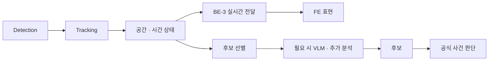
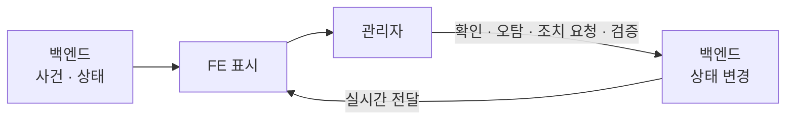

# SENTIA 시스템 개념

> SENTIA는 안전관리 업무 정보와 현장에서 관측한 현실 정보를 공간과 시간 기준으로 연결하는 시스템이다.
> 여러 종류의 현실 입력은 관측과 분석을 거쳐 후보 상태가 되고, 업무 맥락과 정책을 만나 공식 사건이 된다.
> 공식 사건은 관리자의 판단과 조치, 검증을 거쳐 이력과 보고로 남는다.
> 이 문서는 이 연결 구조를 개념 수준에서 설명하며, 구현 방식과 이번 프로젝트의 범위는 정하지 않는다.

역할별 상세 책임은 [02-team-and-roles.md](./02-team-and-roles.md)에서, 이번 프로젝트에서 실제로 선택할 범위는 `04-scope-and-plan.md`에서 다룬다.

## 시스템 개요

SENTIA는 CCTV 영상 하나를 처리하는 단일 파이프라인이 아니다.
업무 정보, 현실 관측, 공간 기준이라는 세 흐름이 만나는 구조다.

```text
[업무 정보]                    [현실 관측]                 [공간 기준]
작업계획 · 위험성평가 · TBM     작업자 · 장비 · 구조물       도면 · BIM
작업 위치 · 인원 · 장비         환경 · 공정 상태             Floor · Zone · Camera
      │                            │                          │
      ▼                            ▼                          │
  업무 맥락 ──────────────→   관측 · 분석  ←─────────────────┘
                                   │
                                   ├──→ 공간 · 시간 상태 ──→ 2D / 2.5D 표현
                                   │                          (향후 3D 확장)
                                   ▼
                                  후보
                                   │  ← 업무 맥락 · 현장 정책
                                   ▼
                               공식 사건
                                   │
                                   ▼
                           관리자 판단 · 조치
                                   │
                                   ▼
                              검증 · 기록
```

SENTIA는 센서 데이터만 처리하는 시스템이 아니라, 현실 관측과 안전관리 업무 맥락을 연결하는 시스템이다.
같은 관측이라도 오늘 그 구역에서 어떤 작업이 예정되어 있고 어떤 위험이 평가되었는지에 따라 의미가 달라지기 때문이다.

## 현실 입력

### 입력 계열

현실 입력은 카메라 한 종류로 제한하지 않는다.
지금까지 논의된 입력 후보는 다음 계열로 나눌 수 있다.

| 계열 | 입력 예시 | 대표 용도 |
|---|---|---|
| 영상 | 고정 CCTV, 녹화 영상 | 작업자, 보호구, 장비, 위험구역, 행동, 실시간 상태 |
| 이미지 | 점검 사진, 스마트폰 사진, DSLR, 드론 이미지 | 균열, 구조물 손상, 근접 점검 |
| 센서 | 환경 센서, 구조물 센서, Thermal, GPS / GNSS, Telematics, Wearable / IMU | 장비 위치·가동, 화재·과열, 가스·환경 상태, 행동 보조 |
| 공간 | 도면, CAD, BIM / IFC, 기준점 | Floor, Zone, 좌표, 구조, 공간 기준 |
| 현장 재현 | 스마트폰 촬영, 360 카메라, Point Cloud, 3DGS | 주기적인 현장 모습, 공정·변화 확인 |
| 가상 입력 | Replay, Simulation, 합성 데이터 | 개발, 검증, 시연, 드문 사건 보강 |

이 표는 제품 범위가 아니라, 지금까지 논의된 현실 입력의 후보군이다.
어떤 입력을 이번 프로젝트에서 사용할지는 `04-scope-and-plan.md`에서 정한다.

문제마다 더 적합한 입력이 따로 있을 수 있다는 점도 고려한다.
예를 들어 균열은 멀리 있는 CCTV보다 근접 촬영 이미지가 적합하고, 장비가 스스로 위치와 가동 정보를 보내 준다면 CCTV로 다시 추정할 필요가 없다.
따라서 CCTV를 모든 문제의 센서로 사용하지 않는다.

### 입력 추상화

입력의 종류와 그 이후의 처리 구조는 가능한 한 분리한다.

```text
Camera · Recorded Video · Image · Sensor · Replay · Simulation
                          │
                          ▼
                  Reality Interface
          (수집 · 정규화 · 시각 맞춤 · 공간 연결)
                          │
                          ▼
                  표준화된 관측 데이터
```

CameraAdapter, FileVideoAdapter, ImageAdapter, SensorAdapter, ReplayAdapter, SimulationAdapter 같은 개념을 예로 들 수 있다.
이 이름은 개념을 설명하기 위한 예시이며, 실제 클래스 이름이나 구현 계약으로 확정한 것은 아니다.

### 재생·모의 입력

실제 공사 현장에 계속 접근하기는 어렵기 때문에, 녹화 데이터와 통제된 테스트 환경을 실제 현장과 같은 구조로 연결하는 것이 중요한 검증 전략이다.

```text
Live Camera ──────┐
Recorded Replay ──┼──→ Reality Interface ──→ 동일한 후속 처리
Testbed Camera ───┘
```

Replay와 Simulation은 테스트를 편하게 하기 위한 부가 기능이 아니다.
같은 처리 구조에 실시간 영상, 녹화 영상, 모의 현장 영상을 넣어 결과를 비교할 수 있게 하는 입력 경로다.
구체적인 구현 방식은 이후에 결정한다.

## 업무 맥락

다음 정보는 AI가 소유하는 정보가 아니라 업무·현장 정본이다.

- 작업계획, 공종, 작업 위치, 인원, 장비
- 위험성평가
- TBM 정보
- Site, Floor, Zone

이 정본은 백엔드가 소유한다.
AI 파이프라인은 관측을 해석할 때 필요한 범위에서 이 정보를 Context로 받아 사용한다.

업무 맥락을 사용하는 것과 소유하는 것은 다르다.
AI는 "오늘 B구역에서는 철근 배근 작업이 예정되어 있다"는 정보를 읽어서 관측을 해석할 수 있지만, 작업계획이나 위험성평가를 직접 만들거나 수정하지 않는다.

## 관측 흐름

현실 입력이 모두 같은 처리 과정을 거치지는 않는다.
처리 성격에 따라 최소한 다음 네 계열로 나눌 수 있다.

| 계열 | 대표 대상 | 개념 흐름 |
|---|---|---|
| 동적 관측 | 작업자, 보호구, 중장비, 위험구역, 행동 | 영상 → Detection → Tracking → 공간·시간 상태 → 후보 |
| 구조 점검 | 균열, 구조물 손상, 누수, 박락 | 점검 이미지 → Detection / Segmentation → 결함 분석 → 구조물·Zone 연결 → 후보 |
| 환경 관측 | 화재, 연기, 과열, 가스, 누출 | RGB / Thermal / 센서 → 상태 분석 → 후보 |
| 현장 변화 | 공정 상태, 현장 변화 | 주기적 촬영 → 현장 재현 처리 → 시점별 공간 상태 → 변화·진행 정보 |

동적 관측은 초 단위로 계속 바뀌는 실시간 문제다.
반면 구조 점검과 현장 변화는 일정 주기로 촬영한 결과를 과거와 비교하는 점검 문제에 가깝다.

SENTIA가 다룰 수 있는 현실 문제는 이처럼 처리 성격에 따라 여러 계열로 나뉘며, 이 중 어떤 계열을 실제 제품 범위에 넣을지는 이후에 선택한다.

## 공간 모델

SENTIA의 공간 데이터는 화면에 표시하는 방식과 독립적으로 관리한다.
좌표는 다음 계층으로 구분한다.

```text
Screen Space      화면 픽셀, 표시용 상태
     ↓
Drawing Space     도면 위 위치
     ↓
Site Local        현장 기준 좌표
     ↓
World Space       실제 지리 좌표
```

정본 데이터는 화면 픽셀이 아니라 현장 공간 기준으로 저장한다.
CCTV 영상에서 얻은 위치도 현장 좌표로 변환한 뒤에 구역과 연결한다.

공간 모델에 연결되는 대표 대상은 Site, Floor, Zone, Camera, 작업자, 장비, 구조물, 위험·사건, 좌표다.
필요에 따라 결함, 센서, 현장 재현 스냅샷도 같은 공간 모델에 연결할 수 있다.

## 시간 모델

SENTIA에는 하나의 시간 단위만 있지 않다.
실시간 관측에서는 짧은 시간 단위가 점점 큰 업무 단위로 묶인다.

```text
Frame → Track → 몇 초간 지속되는 상태 → 후보·사건 → 작업 시간대 → 하루 작업
```

이와 별도로, 점검 사진이나 3DGS 스냅샷처럼 일정 주기로 쌓이는 시간축도 있다.

```text
점검 T0 ── T1 ── T2          현장 스냅샷 T0 ── T1 ── T2
```

SENTIA는 실시간 상태와 주기적 현장 상태를 하나의 Timeline 개념 안에서 연결할 가능성을 가진다.
두 시간축을 어떻게 저장하고 연결할지는 아직 결정하지 않았다.

## AI 처리

AI 처리는 모델 하나를 호출하는 일이 아니다.
지금까지 논의된 처리 유형은 다음과 같다.

- Detection, Segmentation
- Tracking
- 시간 처리(지속 시간, 상태 변화)
- 공간 처리(좌표 변환, Zone 판단, 거리)
- 센서 결합
- VLM 기반 맥락 판단
- 변화 탐지

이 목록은 처리 유형의 후보이며, 모두 구현하기로 확정한 것은 아니다.
역할 관계는 `02-team-and-roles.md`와 같다.
AI-1은 필요한 모델과 인지 결과를 만들고, AI-2는 그 결과를 시스템에서 사용할 수 있는 공간·시간 상태와 후보 정보로 연결한다.

### 실시간 분리

실시간 CCTV 계열에서는 공간 상태를 갱신하는 경로와 후보를 판단하는 경로를 분리한다.



느린 VLM 분석이나 보고서 생성, 사건 처리 때문에 Tracking과 공간 상태 갱신이 멈추지 않도록 한다.
공간 상태는 AI-2가 계산하고, BE-3의 실시간 전달 계층을 거쳐 FE에 표시된다.
실시간 갱신 주기는 아직 정하지 않았다.

### VLM 위치

카메라 영상을 모두 VLM에 넣어 위험을 판단하는 구조는 사용하지 않는다.

```text
1차 인지 → Tracking · 공간 · 상태 처리 → 후보 선별 → 필요한 경우 VLM → 후보 보강·설명
```

VLM은 걸러진 후보의 맥락을 한 번 더 판별하는 2차 도구다.
어떤 사건에 사용할지, 어떤 모델과 입력 형식을 쓸지, 이번 프로젝트에 포함할지는 아직 결정하지 않았다.

## 사건 흐름

### 후보 계층

AI와 현장 재현 처리의 결과는 서비스가 검토할 수 있는 후보 상태로 정리된다.
현재 대표 흐름인 안전 관제에서는 이 후보를 `RiskCandidate`라고 부른다.

다만 앞으로 다룰 수 있는 문제에는 안전 위험 외에도 구조 결함, 환경 이상, 공정·현장 변화가 있다.
그래서 모든 후보를 `RiskCandidate` 하나로 통합할지는 확정하지 않았으며, 후보 유형의 최종 모델은 이후에 논의한다.

### 사건 계층

현재 안전 관제의 대표 흐름은 다음과 같다.

```text
AI 후보 → 업무 맥락 · 현장 정책 적용 → SafetyEvent
```

현재 안전 관제의 공식 사건은 `SafetyEvent`로 표현한다.
균열, 구조 결함, 공정 이상, 환경 이상이 `SafetyEvent`, `DefectEvent`, `Issue`, `Anomaly` 중 어떤 유형으로 관리될지는 아직 결정하지 않았다.
다른 관측 계열의 공식 모델은 제품 범위가 정해진 뒤에 결정한다.

### 처리 흐름

사건의 종류와 관계없이, 공식 사건은 다음과 같은 업무 흐름을 거친다.

```text
후보 → 공식 사건 → 관리자 검토 → 조치 → 현장 확인 → 검증 → 종료 → 이력·보고
```

이 흐름에서 각 주체의 몫은 다음과 같이 나뉜다.

| 주체 | 몫 |
|---|---|
| AI | 후보와 판단 근거 제공 |
| 관리자 | 최종 업무 판단과 조치 |
| 백엔드 | 공식 상태와 이력 관리 |

## 조치 흐름

FE는 상태를 보여주기만 하는 화면이 아니다.
관리자의 판단과 조치가 FE를 거쳐 백엔드로 들어가고, 바뀐 상태가 다시 FE로 돌아온다.



구체적인 버튼과 상태 값은 아직 정하지 않았다.

### 기록 원칙

모든 AI 결과를 영구히 저장하지는 않는다.
현재까지 유지된 저장 방향은 다음과 같다.

| 대상 | 저장 방향 |
|---|---|
| 원본 Detection | 대부분 단기 보관 또는 비저장 |
| 현재 상태 | 최신 상태 중심으로 유지 |
| 중요한 후보·사건 | 필요 시 저장 |
| 증거 자료 | 사건의 근거로 저장 가능 |
| 조치·이력 | 업무 이력으로 저장 |
| 보고서 | 이력을 바탕으로 생성 |

정확한 보존 기간과 저장소는 이후에 설계한다.

## 표현 계층

화면 표현은 정본 데이터가 아니다.
같은 공간 상태와 도메인 상태를 여러 방식으로 표현할 수 있다.

```text
공간 상태 · 도메인 상태
        │
        ├──→ Canvas       2D
        ├──→ Three.js     2.5D
        └──→ Unreal       향후 3D
```

2D와 2.5D는 현재 핵심 공간 표현 방향이다.
3DGS, BIM, Unreal은 기존 공간 상태와 사건을 그대로 다시 사용하는 확장 방향이다.
표현 방식이 바뀌어도 층, 대상, 위치, 시간 맥락은 유지되어야 한다.

## 확장 구조

3DGS는 실시간 CCTV를 대체하지 않는다.
두 입력은 서로 다른 시간축을 담당한다.

| 입력 | 성격 | 결과 |
|---|---|---|
| 고정 CCTV | 계속 이어지는 실시간 관측 | 작업자·장비의 현재 상태 |
| 스마트폰 현장 순회 촬영 | 주기적인 현장 재현 | 3DGS 스냅샷 |

3D 계층은 다음처럼 역할을 나눈다.

```text
보이는 것      3DGS         실제 현장의 최신 모습 (Reality Layer)
계산하는 것    BIM / Mesh   구조, 기하 정보, 객체 의미
운영하는 것    Unreal       통합 3D 화면과 시뮬레이션 실행 환경
```

3DGS 스냅샷을 같은 좌표계에 시점별로 쌓으면, 현장 변화를 시간 순서로 비교하는 화면을 만들 수 있다.
이 확장 기술들을 실제로 구현할지는 아직 정하지 않았다.

## 현재 상태

| 상태 | 내용 |
|---|---|
| 방향 확정 | 업무 맥락과 현실 관측을 연결한다<br>업무·현장 정본은 백엔드가 소유하고, AI는 Context로 사용한다<br>공간 데이터는 화면 표현과 독립적으로 현장 좌표 기준으로 관리한다<br>실시간 공간 상태 갱신과 사건 처리를 분리한다<br>VLM은 전체 영상이 아니라 후보에 대한 2차 판단에 사용한다<br>최종 판단과 조치는 관리자가 한다<br>2D·2.5D를 현재 핵심 공간 표현으로 둔다<br>Replay와 Testbed 입력을 실시간 입력과 같은 구조로 처리할 수 있게 한다 |
| 논의 필요 | 최종 관측 대상<br>균열·구조 점검 포함 범위<br>화재·환경 센서 범위<br>공정·현장 변화 범위<br>후보 공통 모델<br>공식 사건의 도메인 유형<br>VLM 실제 적용 범위<br>데이터 보존 정책<br>실시간 갱신 주기<br>센서 실제 사용 여부 |
| 선택 가능성 | 3DGS<br>BIM 고도화<br>Unreal<br>Thermal<br>Telematics<br>Wearable<br>Multi-camera<br>LiDAR / RGB-D |
