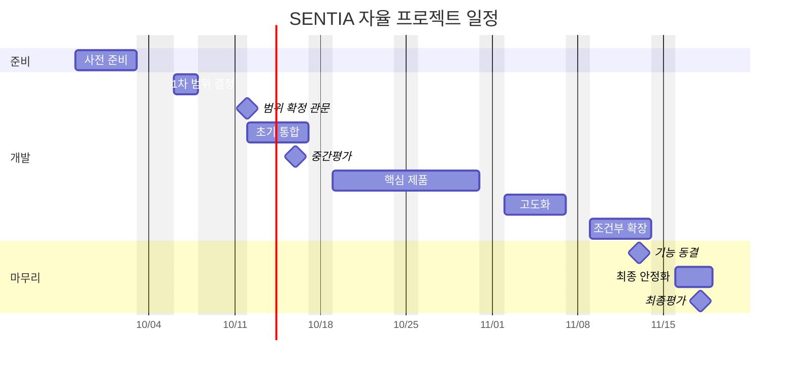

# SENTIA 범위와 계획

> 이 문서는 01~03에서 정한 제품 방향을 이번 자율 프로젝트 기간 안에 어디까지 구현할지 관리한다.
> 제품의 기본 구조는 다시 정의하지 않고, 구체적인 사건, 데이터, 현장 수신 단말, 기술 깊이를 팀 합의로 정한다.

## 문서 역할

| 문서 | 다루는 질문 |
|---|---|
| [01-project-overview.md](./01-project-overview.md) | 왜 만들고, 어떤 문제를 해결하는가 |
| [02-team-and-roles.md](./02-team-and-roles.md) | 누가 무엇을 책임지는가 |
| [03-system-concept.md](./03-system-concept.md) | 시스템의 정보와 상태가 어떻게 흐르는가 |
| 04-scope-and-plan.md | 이번 기간에 무엇을 어느 수준까지 만드는가 |

이 문서는 API 명세, DB 설계, 개인별 작업 목록, 모델 세부 설계를 대신하지 않는다.
시스템 구조는 다시 설명하지 않고 03을 따른다.

## 계획 기준

세 가지 핵심 문제에 대응하는 제품 구조는 이미 방향이 정해져 있다.
이 구조 전체를 빼는 것은 범위 조정이 아니라 제품 정의를 바꾸는 일이므로, 필요하면 팀이 명시적으로 다시 합의해야 한다.

| 핵심 문제 | 유지할 제품 구조 | 팀이 정할 것 |
|---|---|---|
| 오탐과 맥락 부족 | 사건 후보, 사건 검토 대기열, 맥락 확인(필요 시 VLM), 우선순위와 위험 상태, 관리자 승인·기각, 오탐 기록 | 사건 종류, VLM 적용 범위, 위험 판단 기준 |
| 공간 정보 단절 | 현장·층·구역 기준의 공간 상태, 도면 기반 2D·2.5D 관제 | 카메라 보정 수준, 2D·2.5D 구현 범위 |
| 조치와 기록 단절 | 현장 조치 전달, 수신 확인, 조치 확인, 증빙, 이력, AI 보고서 초안과 안전관리자 검토 | 현장 수신 단말 형태, 보고서 종류와 서식 |

범위를 줄일 때는 이 표를 기준으로 어느 핵심 문제의 해결력이 약해지는지 명시적으로 확인한다.

## 일정 전제

### 공식 일정

| 날짜 | 일정 | 계획상 의미 |
|---|---|---|
| 9/28~10/2 | 공통 프로젝트 마무리, 자율 프로젝트 팀 빌딩 | 사전 준비 |
| 10/5 (월) | 개천절 대체공휴일 | 정상 작업일에서 제외 |
| 10/6 (화) | 실질적인 작업 시작 | 프로젝트 착수 |
| 10/8 (목) | 필드트립 | 정상 작업일에서 제외 |
| 10/9 (금) | 한글날 | 공휴일 |
| 10/16 (금) | 중간평가 | 첫 통합 상태 확인 |
| 11/13 (금) | 기능 동결 | 신규 기능 개발 종료 |
| 11/16~11/18 | 최종 안정화 | 검증, 리허설, 발표 준비 |
| 11/18 (수) | 최종평가 | 개발 종료 |
| 11/23~11/24 | 본선 발표회 | 평가 이후 발표 |
| 12/1 | 전시발표회 | 결과물 전시 |

본선 발표회와 전시발표회 기간은 핵심 제품 개발 기간으로 계산하지 않는다.

### 첫 주

2026년 10월 3일 개천절이 토요일이어서 10월 5일 월요일이 대체공휴일이다.
10/8 필드트립과 10/9 한글날까지 고려하면, 첫 주에 정상적으로 작업할 수 있는 날은 10/6과 10/7 이틀뿐이다.
따라서 첫 주를 일반적인 5일 작업 주간으로 계산하지 않는다.

### 실질 기간

10/5부터 11/18까지 평일은 33일이다.
대체공휴일, 필드트립, 한글날을 빼면 정상 작업일은 약 30일이다.
11/13에 기능 동결(Feature Freeze)을 하면, 신규 기능 개발에 쓸 수 있는 날은 약 27일이다.

이 숫자는 범위를 보수적으로 잡아야 하는 근거다.
"8주 프로젝트"라는 표현은 실제 개발 가능 기간과 차이가 크므로 사용하지 않는다.

## 계획 원칙

### 업무 우선

기술부터 고르고 업무를 맞추지 않는다.
안전관리 업무 → 핵심 문제 → SENTIA 개입 지점 → 필요한 현실 정보 → 기능 → 기술 순서로 정한다.

### 문제 추적

모든 범위 결정은 다음 세 질문을 통과해야 한다.

- 오탐과 맥락 부족을 어떻게 줄이는가
- 공간 정보 단절을 어떻게 해결하는가
- 조치와 기록 단절을 어떻게 연결하는가

기능이 화려해도 세 가지 핵심 문제와 관계가 약하면 우선순위를 낮출 수 있다.

### 초기 통합

각 파트를 따로 완성하기보다, 작더라도 처음부터 끝까지 연결된 흐름을 먼저 만든다.
연결할 흐름은 현실 입력 → 탐지 → 사건 후보 → 사건 검토 대기열 → 맥락·공간 확인 → 관리자 검토 → 승인·기각 → 조치 → 조치 확인·이력 → 보고서 초안이다.

초기 통합 단계에서는 중간 단계를 최소 구현으로 채울 수 있다.
그러나 핵심 제품 단계에서는 선택한 핵심 시연 흐름이 실제로 끝까지 이어져야 한다.

### 사람의 판단

AI가 최종 위험 판단이나 공식 보고서를 확정하지 않는다.
사건 후보는 관리자가 승인하거나 기각하고, 보고서 초안은 안전관리자가 검토하고 수정한다.

### 핵심 우선

3DGS, Unreal, 추가 센서, 다중 카메라 같은 확장은 핵심 제품이 안정된 뒤에만 진행한다.

### 마지막 주

11/16 이후에는 신규 기능 추가를 원칙적으로 금지한다.

## 팀 합의 항목

### 시연 흐름

| 항목 | 상태 | 결정 기준 |
|---|---|---|
| 핵심 시연 흐름에 사용할 구체 사건 | 팀 합의 필요 | 업무 가치, 시연성, 데이터 |
| 핵심 업무 범위의 깊이 | 팀 합의 필요 | 실제 안전관리 업무, 일정 |
| 핵심 관측 대상과 사건 | 팀 합의 필요 | 업무 가치, 데이터와 모의 현장 |
| 필수·권장 범위 | 팀 합의 필요 | 핵심 시연 흐름과 세 가지 핵심 문제 |

핵심 시연 흐름의 기본 구조는 이미 정해져 있다.
현실 관측 → 사건 후보 → 맥락·공간 판단 → 관리자 승인·기각 → 승인 시 현장 조치 → 조치 확인·증빙 → AI 보고서 초안 순서다.
팀이 정할 것은 이 흐름을 어떤 사건으로, 어느 깊이까지 보여 줄지다.

### 오탐 판단

| 항목 | 상태 |
|---|---|
| 관리자 승인·기각 | 방향 확정 |
| 오탐 기록 | 방향 확정 |
| 우선순위와 위험 상태의 세부 계산 | 팀 합의와 검증 필요 |
| VLM을 적용할 사건 | 팀 합의와 검증 필요 |
| 오탐 기록을 모델 개선 자료로 활용하는 범위 | 팀 합의 필요 |
| 자동 재학습 | 미정이며 기본 전제가 아님 |

### 현장 전달

현장 조치 전달은 제품 방향에서 빼지 않는다.
제품 방향에서는 안전관리자와 작업자의 스마트워치를 목표 단말로 두며, 이번 프로젝트에서 구현할 형태는 팀이 정한다.

| 후보 | 상태 |
|---|---|
| 스마트워치 전용 앱 | 팀 합의 필요 |
| 모바일 웹·앱 | 팀 합의 필요 |
| 웹 화면 | 팀 합의 필요 |
| 모의 현장용 모의 수신 단말 | 팀 합의 필요 |

최소한 승인된 조치 요청이 관리자 화면에만 남고 현장에 전달되지 않는 구조는 피한다.

### AI 보고서

이력과 증빙을 바탕으로 한 AI 보고서 초안은 제품 방향에 포함한다.
팀이 정할 항목은 다음과 같다.

- 보고서 종류: 일일 안전일지, 조치 보고, 아차사고 기록, 위험성평가 반영 자료 등
- 사용할 모델
- 서식 기반 생성인지, 자유 생성인지
- 증빙 자료를 보고서에 어떻게 연결할지
- 출력 형식
- 이번 프로젝트에서 구현할 보고서 수
- AI 보고서 생성의 실행 위치와 담당

최종 보고서는 안전관리자가 검토하고 수정하는 구조를 유지한다.

### 사건 후보

다음은 모두 후보이며, 우선순위는 팀이 정한다.

| 후보 | 관측 계열 | 상태 |
|---|---|---|
| 보호구 미착용 | 동적 관측 | 미정 |
| 위험구역 진입 | 동적 관측 | 미정 |
| 작업자·중장비 접근 | 동적 관측 | 미정 |
| 작업자 쓰러짐 | 동적 관측 | 미정 |
| 추락·낙하·충돌·전도 | 동적 관측 | 미정 |
| 균열·구조물 결함 | 구조 점검 | 미정 |
| 화재·연기·과열 | 환경 관측 | 미정 |
| 가스·누출 | 환경 관측 | 미정 |
| 공정·현장 변화 | 현장 변화 | 미정 |

관측 대상이 늘어나면 그만큼 모델과 처리 파이프라인의 부담도 늘어나므로, 많이 탐지하는 것 자체를 목표로 삼지 않는다.

### 공간·확장

| 항목 | 상태 |
|---|---|
| 현장·층·구역 기준 공간 연결 | 방향 확정 |
| 2D 도면 관제 | 방향 확정 |
| 2.5D 구현 깊이 | 팀 합의 필요 |
| 3DGS | 조건부 |
| BIM 고도화 | 조건부 |
| Unreal | 조건부 |
| 열화상·장비 운행 정보·착용형 센서 | 조건부이거나 관측 대상 선택에 따라 결정 |

## 결정 기록

팀 합의는 다음 항목으로 기록한다.

- 항목
- 결정 내용
- 근거
- 검토한 대안
- 결정일
- 재검토 조건
- 영향을 받는 핵심 문제
- 영향을 받는 역할

범위를 바꿀 때는 무엇을 뺐는지뿐 아니라, 어떤 핵심 문제와 역할에 영향을 주는지 함께 기록한다.

## 범위 분류

| 분류 | 의미 |
|---|---|
| 필수(Must) | 핵심 시연 흐름과 제품 기본 구조를 성립시키는 데 반드시 필요하다 |
| 권장(Should) | 가치가 높지만 핵심 제품을 해치지 않는 범위에서 구현한다 |
| 조건부(Conditional) | 진행 관문을 통과한 뒤에만 시작한다 |
| 제외(Out) | 이번 일정에서는 구현하지 않는다 |

제외는 아이디어를 폐기한다는 뜻이 아니다.

## 데이터 계획

핵심 사건이 정해지면 다음 목적별로 데이터를 나누어 관리한다.

| 목적 | 의미 |
|---|---|
| 학습 | 모델 학습과 미세 조정 |
| 검증·평가 | 실제 성능 확인 |
| 시연 | 평가 환경에서 재현할 시연 데이터 |

| 사건 | 학습 | 검증·평가 | 시연 | 자체 촬영 | 확보 상태 | 위험 |
|---|---|---|---|---|---|---|
| 미정 | 미정 | 미정 | 미정 | 미정 | 미정 | 미정 |

그동안 조사한 공개 데이터셋은 후보 자료다.
사건이 정해지기 전에 특정 데이터셋을 프로젝트 표준으로 고정하지 않는다.

## 시연 환경

현재 가능한 조합은 다음과 같다.

- 녹화 영상이나 공개 데이터의 녹화 재생
- 통제된 모의 현장(Testbed)
- 실제 현장에서 확보한 자료
- 실제 건설 현장
- 위 방식의 혼합

실제 건설 현장 접근을 프로젝트 성공의 필수 조건으로 두지 않는다.
위험한 사고를 모의 현장에서 실제로 재현하지 않으며, 드물고 위험한 사건은 공개 데이터, 녹화 재생, 안전한 대체 상황, 합성 데이터로 다룬다.

## 단계 계획

각 단계는 작업 개수가 아니라 제품이 어떤 상태로 동작하는지를 기준으로 완료를 판단한다.

| 단계 | 기간 | 정상 작업일 | 완료 상태 |
|---|---|---|---|
| 사전 준비 | 9/28~10/2 | 개발 기간에서 제외 | 무엇을 합의해야 하는지 명확하다 |
| 1차 범위 결정 | 10/6~10/7 | 2일 | 후보가 좁혀지고, 기술 검증 항목이 정해졌다 |
| 범위 확정 관문 | 10/12 초기 | 초기 통합과 겹침 | 필드트립 결과까지 반영해 초기 통합 범위를 잠정 확정했다 |
| 초기 통합 | 10/12~10/16 | 5일 | 한 사건이 처음부터 끝까지 연결되어 동작한다 |
| 핵심 제품 | 10/19~10/30 | 10일 | 확장 없이 세 가지 핵심 문제를 모두 보여 준다 |
| 고도화 | 11/2~11/6 | 5일 | 핵심 제품의 설득력이 높아졌다 |
| 조건부 확장 | 11/9~11/13 | 5일 | 핵심 제품을 해치지 않고 가치를 더했다 |
| 최종 안정화 | 11/16~11/18 | 3일 | 평가 환경에서 결과를 반복해서 재현할 수 있다 |

### 사전 준비

공통 프로젝트를 마무리하면서 팀을 꾸리는 기간이며, 정식 개발 기간으로 계산하지 않는다.
이 기간에는 01~04 공유, 안전관리 업무와 핵심 문제 확인, 사건 후보와 데이터셋 조사, 모의 현장 가능성 확인, 기술 검증 목록 작성, 개발 환경 준비를 진행할 수 있다.

### 1차 범위 결정

정상 작업일이 10/6과 10/7 이틀뿐이다.
이 기간에는 핵심 시연 흐름과 사건 후보를 좁히고, 세 가지 핵심 문제 대응을 점검하고, 데이터 입력원 후보를 정하고, 기술 검증을 시작하고, 역할별 부담을 확인한다.
모든 범위를 이틀 안에 영구히 고정하지 않으며, 10/8 필드트립 결과는 범위 확정 관문에서 반영한다.

### 초기 통합

중간평가까지 작지만 실제로 연결된 SENTIA를 만든다.
10/12 초기에는 범위 확정 관문에서 필드트립 결과와 남은 결정을 정리하고, 그 뒤 구현을 본격적으로 진행한다.

권장 흐름은 현실 입력 → 탐지·이상 징후 → 사건 후보 → 공간 위치 → 관리자 검토 → 승인 또는 기각이다.
가능하면 승인 경로에 최소한의 조치 상태까지 연결한다.
보고서 생성과 실제 현장 수신 단말은 이 단계에서 최소 구현이어도 되지만, 이후 실제 흐름으로 이어질 수 있도록 주고받을 형식은 미리 정해 둔다.
완료 조건은 초기 통합 관문을 따른다.

### 핵심 제품

이 단계가 끝나면 조건부 확장이 하나도 없어도 세 가지 핵심 문제를 모두 제품으로 설명할 수 있어야 한다.
이 시점이 실제 본제품 완성선이며, 완료 조건은 핵심 제품 관문을 따른다.

### 고도화

핵심 제품을 더 설득력 있게 만드는 기간이다.
오탐 감소와 맥락 강화, VLM, 우선순위와 위험 상태 고도화, 오탐 사례 관리, AI 보고서 품질과 서식 추가, 조치·알림 화면 개선, 2.5D, 도입 전후 비교, 성능과 모니터링, 증빙 화면 개선이 후보다.
무엇을 선택할지는 핵심 제품의 상태와 팀 합의를 따른다.

### 조건부 확장

이 기간은 특정 기술에 미리 배정하지 않는다.
핵심 제품과 시연이 안정적일 때만 3DGS, Unreal, BIM 고도화, 다중 카메라와 객체 재식별, 열화상과 추가 센서, 추가 사건, 고급 AI 기능을 검토한다.

핵심 제품이 흔들리면 바로 확장을 중단하고, 이 기간을 버그 수정, 오탐 개선, 현장 전달 안정화, AI 보고서 품질, 화면 사용성, 성능, 시연 대체 수단 준비에 쓴다.
11/13에 기능을 동결한다.

### 최종 안정화

신규 기능 추가를 원칙적으로 금지한다.

- 통합 테스트와 장애 대응 준비
- 시연 데이터 고정
- 서버, GPU, 네트워크 점검
- 현장 수신 단말의 대체 수단 준비
- AI 보고서 결과의 재현성 확인과 VLM·AI 실패 시 대체 방법 준비
- 발표 시나리오, 리허설, 시연 영상
- 문서와 최종 디자인 정리

## 진행 관문

### 핵심 문제 대응 점검

범위나 기능을 줄일 때마다 다음을 확인한다.

1. 관리자 승인·기각까지 이어지는 오탐 제어 흐름이 남아 있는가
2. 사건을 현장 공간 위에서 설명할 수 있는가
3. 승인된 사건이 현장 조치와 AI 보고서까지 이어지는가

하나라도 빠지면 팀이 제품 범위 변경으로 명시적으로 기록한다.

### 범위 확정 관문

10/12 초기에 진행한다.
1차 범위 결정의 논의와 필드트립 결과를 반영해, 초기 통합과 핵심 제품 개발에 필요한 수준으로 범위를 잠정 확정한다.

- 어떤 사건으로 시연하는가
- 어떤 입력원을 쓰는가
- 사건 후보를 만들 수 있는가
- 공간 맥락을 제공할 수 있는가
- 승인·기각을 보여 줄 수 있는가
- 승인 후 조치 요청을 어디로 전달하는가
- 조치 확인과 증빙을 어떻게 돌려받는가
- AI 보고서 초안을 어떤 최소 형태로 연결하는가
- 역할별 일정을 감당할 수 있는가

이 관문은 모든 요구사항을 영구히 고정하는 시점이 아니다.
데이터 확보 실패, 기술 검증 실패, 역할 과부하, 시연 불가능, 예상보다 높은 통합 비용이 확인되면 범위를 줄일 수 있다.

### 초기 통합 관문

중간평가 전후에 다음을 확인한다.

- 한 사건이 처음부터 끝까지 재현된다
- 2D 공간에서 위치를 확인할 수 있다
- 관리자가 승인하거나 기각할 수 있다
- 기각된 후보가 오탐 기록으로 분리된다
- 승인된 후보가 다음 조치 단계로 넘어갈 수 있다

연결에 실패하면 새 기능보다 통합을 먼저 해결한다.

### 핵심 제품 관문

10월 말에 다음을 확인한다.

| 핵심 문제 | 완료 조건 |
|---|---|
| 오탐과 맥락 부족 | 사건 후보와 즉시 경보가 구분된다 사건 검토 대기열이 있다 선택한 맥락이 반영된다 관리자 승인·기각이 동작한다 오탐이 따로 기록된다 |
| 공간 정보 단절 | 선택한 입력원과 도면·구역이 연결된다 관제 화면에서 공간 상태를 확인할 수 있다 위치 판단이 화면 좌표에 묶이지 않는다 |
| 조치와 기록 단절 | 승인된 사건이 조치 요청으로 이어진다 선택한 현장 수신 단말이나 같은 역할의 시험용 단말에 전달된다 수신 확인이나 완료 상태를 받을 수 있다 조치 확인과 증빙이 이력으로 남는다 구조화된 이력으로 AI 보고서 초안을 만든다 안전관리자가 초안을 검토할 수 있다 |

이와 함께 핵심 시연 흐름을 끝까지 진행할 수 있고, 핵심 데이터를 확보했고, 시연할 수 있어야 한다.

### 확장 여부 관문

11월 초에 다음 조건을 모두 확인한다.

- 핵심 제품 관문을 통과했다
- 진행을 막는 문제가 없다
- 파트별 필수 범위를 완료했다
- 시연 흐름을 확보했다
- 확장을 끝낼 시간이 충분하다

하나라도 충족하지 못하면 확장하지 않는다.
확장하지 않는 것은 실패가 아니라 핵심 제품의 완성도를 지키는 결정이다.

## 기능 동결

기본 기능 동결 시점은 11/13 금요일이다.
이후에 신규 기능을 넣으려면 시간이 조금 남았다는 이유만으로는 부족하며, 팀의 예외적인 합의가 필요하다.
11/16부터는 제품을 키우는 기간이 아니라 제품이 실패하지 않도록 만드는 기간이다.

## 역할 부담

역할은 02에서 정의했으므로 여기서 다시 정의하지 않는다.
범위를 정할 때 선택한 기능이 특정 역할에 몰리지 않는지 확인한다.

| 범위 추가 | 부담이 늘어나는 역할 |
|---|---|
| 사건·모델 추가 | AI-1 |
| 추적, 공간 처리, VLM | AI-2 |
| AI 보고서 생성 방식·실행 구조 확대 | 실행 담당 결정 후 해당 역할 |
| 맥락, 위험 정책, 검토 기준 | BE-1 |
| 조치, 증빙, 보고 업무 흐름 | BE-2 |
| 실시간 전달, 알림, 현장 수신 단말 | BE-2 |
| 검토, 조치, 보고 화면 | FE-1 |
| 도면 관제, 2.5D, 3DGS·BIM·Unreal | Spatial-1 |

부담이 한 역할에 몰리면 역할 경계를 흐리기보다 범위를 줄이는 것을 우선한다.
BE-2는 조치 업무와 공통 플랫폼을 함께 맡으므로, 범위를 늘릴 때 BE-2의 부담을 가장 먼저 확인한다.

## 위험 관리

| 위험 | 대응 |
|---|---|
| 사건 종류 과다 | 핵심 시연 흐름을 기준으로 줄인다 |
| 데이터 부족 | 범위 확정 관문 전에 확보 가능성을 검증한다 |
| 실제 현장 미확보 | 녹화 재생과 모의 현장으로 대신한다 |
| AI 오탐 | 사건 후보 선별, 맥락 결합, 관리자 검토로 대응한다 |
| 공간 좌표 오차 | 카메라 보정을 실측으로 확인한다 |
| VLM 처리 지연 | 실시간 처리와 느린 AI 작업을 분리한다 |
| 현장 전달 실패 | 수신 단말의 대체 수단을 준비한다 |
| AI 보고서의 부정확한 내용 | 구조화된 정보와 증빙을 근거로 쓰고, 안전관리자가 검토한다 |
| 파트별 개발 후 통합 실패 | 초기에 전체 흐름을 먼저 연결한다 |
| 확장이 일정을 잠식 | 확장 여부 관문으로 통제한다 |
| 특정 역할 과부하 | 범위를 줄인다 |
| 운영·플랫폼 부담이 BE-2에 집중 | 플랫폼 구현 깊이를 핵심 시연 흐름을 실행하는 수준으로 제한하고, 범위를 정할 때 BE-2의 부담을 먼저 확인한다 |
| 업무 화면과 공간 화면의 통합 실패 | 초기 통합 단계에서 공간 화면의 사건 선택과 업무 화면의 검토 흐름을 먼저 연결한다 |
| 3D 확장이 2D 관제보다 먼저 진행됨 | Spatial-1은 2D 도면 관제를 먼저 완성하고, 3D 확장은 확장 여부 관문을 통과한 뒤에 시작한다 |
| 마지막 주 기능 추가 | 11/13 기능 동결을 지킨다 |

새로운 위험이 확인되면 이 표에 추가한다.

## 현재 상태

| 상태 | 내용 |
|---|---|
| 방향 확정 | 세 가지 핵심 문제를 모두 제품 구조로 해결 사건 검토 대기열과 관리자 승인·기각 현장·층·구역 기준 공간 관제 승인 후 현장 조치 전달 수신 확인, 조치 확인, 증빙, 이력 이력 기반 AI 보고서 초안과 안전관리자 검토 공식 일정, 공휴일, 11/13 기능 동결 |
| 팀 합의 필요 | 핵심 시연 사건 관측 입력원 필수·권장 범위의 깊이 현장 수신 단말의 구현 형태 AI 보고서 종류, 서식, 실행 위치와 담당 VLM 적용 범위 2.5D 깊이 |
| 검증 필요 | 데이터셋 모델 성능과 오탐 수준 객체 추적과 카메라 보정 처리 지연과 대기열 적체 현장 수신 단말의 재현성 AI 보고서 품질 GPU와 모의 현장 환경 |
| 조건부 | 3DGS BIM 고도화 Unreal 다중 카메라와 객체 재식별 열화상·장비 운행 정보·착용형 센서 기타 확장 |

팀 합의가 끝날 때마다 이 문서를 갱신한다.
