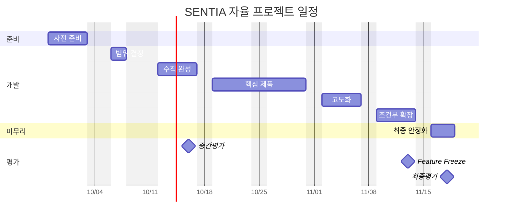

# SENTIA 범위와 계획

> 이 문서는 01~03에서 열어 둔 가능성 중에서 이번 자율 프로젝트에서 무엇을 선택할지 팀이 합의하는 과정을 관리한다.
> 또한 제한된 실제 일정 안에서 어떤 순서와 조건으로 제품을 완성할지를 정한다.
> 아직 팀이 합의하지 않은 범위는 결정하지 않고 `팀 합의 필요`로 표시하며, 합의가 끝나면 이 문서를 갱신한다.

이 문서는 세 가지를 함께 관리한다.

| 구분 | 관리 내용 |
|---|---|
| 범위 | 무엇을 하고, 하지 않고, 조건부로 할지 |
| 계획 | 언제 어떤 완성 상태에 도달해야 하는지 |
| 관문 | 어떤 조건이 충족되어야 다음 단계로 넘어가는지 |

API 명세, DB 설계, 개인별 작업 목록, 모델 상세 설계는 이 문서에서 다루지 않는다.
역할과 책임 경계는 [02-team-and-roles.md](./02-team-and-roles.md), 가능한 시스템 구조는 [03-system-concept.md](./03-system-concept.md)를 따른다.

## 일정 전제

### 공식 일정

| 날짜 | 일정 | 계획상 의미 |
|---|---|---|
| 9/28~10/2 | 공통 프로젝트 마무리, 팀 빌딩 | 사전 준비 |
| 10/5 (월) | 개천절 대체공휴일 | 정상 개발일에서 제외 |
| 10/6 (화) | 실질적인 정식 작업 시작 | 프로젝트 착수 |
| 10/8 (목) | 필드트립 | 정상 개발일에서 제외 |
| 10/9 (금) | 한글날 | 공휴일 |
| 10/16 (금) | 중간평가 | 첫 통합 상태 확인 |
| 11/13 (금) | 권장 Feature Freeze | 신규 기능 개발 종료 |
| 11/16~11/18 | 최종 안정화 | 검증, 리허설, 발표 준비 |
| 11/18 (수) | 최종평가 | 개발 종료 시점 |
| 11/23~11/24 | 본선 발표회 | 평가 이후 발표 |
| 12/1 | 전시발표회 | 결과물 전시 |

본선 발표회와 전시발표회 기간은 핵심 개발 기간으로 계산하지 않는다.

### 첫 주

2026년 10월 3일 개천절이 토요일과 겹치기 때문에 10월 5일 월요일이 대체공휴일이다.
따라서 정식 프로젝트의 첫 주인 10/5~10/9는 정상적인 5일 개발주가 아니다.

| 날짜 | 구분 |
|---|---|
| 10/5 (월) | 대체공휴일 |
| 10/6 (화) | 정상 작업 |
| 10/7 (수) | 정상 작업 |
| 10/8 (목) | 필드트립 |
| 10/9 (금) | 한글날 |

첫 주에 정상적으로 작업할 수 있는 날은 10/6과 10/7 이틀뿐이다.

### 실질 기간

정식 프로젝트는 달력상 10/5부터 11/18까지이며, 이 기간의 평일은 33일이다.
여기서 대체공휴일, 필드트립, 한글날을 빼면 실제로 작업할 수 있는 날은 약 30일이다.
최종평가 직전까지 신규 기능을 개발하지 않고 11/13에 기능 개발을 멈추면, 신규 기능 개발에 쓸 수 있는 정상 작업일은 약 27일이다.

이 숫자는 이번 프로젝트의 범위를 보수적으로 잡아야 하는 근거다.
과거 논의에서 쓰던 "8주 프로젝트"라는 표현은 실제 개발 가능 기간과 차이가 크기 때문에 사용하지 않는다.

## 계획 원칙

### 업무 우선

범위는 기술에서 출발하지 않고, 안전관리 업무에서 출발한다.

```text
안전관리 업무 → SENTIA 개입 지점 → 필요한 현실 정보 → 제품 기능 → 필요 기술
```

### 통합 우선

각 파트가 따로 완성되는 것보다, 처음부터 끝까지 연결된 흐름을 먼저 확보한다.
AI 모델, 백엔드, FE 화면이 각각 완성되었더라도 서로 연결되지 않으면 제품이 아니다.

```text
현실 입력 → AI·관측 → 후보·상태 → 백엔드 → 관제 화면 → 사용자 판단·조작
```

작은 범위라도 이 흐름을 초기에 한 번 완주한다.

### 핵심 우선

핵심 기능이 불안정하면 확장 기능을 시작하지 않는다.
핵심 기능이 안정된 뒤에만 남은 일정과 가치를 검토하여 확장 여부를 정한다.
확장 기능 때문에 핵심 제품이 늦어지지 않도록 한다.

### 결정 분리

각 항목의 상태는 다음 다섯 가지로 구분한다.

| 상태 | 의미 |
|---|---|
| 방향 확정 | 팀이 이미 합의한 방향 |
| 팀 합의 필요 | 팀 논의로 결정해야 하는 항목 |
| 실험·조사 필요 | 데이터, 성능, 환경을 확인해야 결정할 수 있는 항목 |
| 조건부 | 특정 관문을 통과했을 때만 착수하는 항목 |
| 범위 제외 | 이번 프로젝트에서 구현하지 않기로 합의한 항목 |

`팀 합의 필요` 항목은 문서 작성자가 임의로 Must나 Out으로 바꾸지 않는다.

## 합의 항목

현재 팀 합의가 필요한 항목은 다음과 같다.
결정 시점은 팀 일정에 따라 조정할 수 있다.

| 항목 | 현재 상태 | 결정에 필요한 근거 | 결정 시점 |
|---|---|---|---|
| Main Demo Story | 팀 합의 필요 | 업무 가치, 시연성 | 범위 결정 단계 |
| 핵심 업무 범위 | 팀 합의 필요 | 안전관리 직무 분석 | 범위 결정 단계 |
| 핵심 관측·사건 | 팀 합의 필요 | 업무 가치, 데이터 확보 가능성 | 범위 결정 단계 |
| 제품 Must / Should | 팀 합의 필요 | 위 세 항목의 결정 결과 | Scope Gate |
| 균열 포함 여부 | 팀 합의 필요 | 데이터, 역할 부담 | Scope Gate |
| 화재·환경 관측 | 팀 합의 필요 | 필요성, 센서 확보 | Scope Gate |
| 공정·현장 변화 | 팀 합의 필요 | 제품 가치, 데이터 | Scope Gate |
| 작업자 Endpoint 범위 | 팀 합의 필요 | 조치 흐름에서의 필요성, FE·BE 부담 | Scope Gate |
| VLM 적용 범위 | 팀 합의와 실험 필요 | 오탐 개선 효과, 응답 지연 | 범위 결정 단계에서 중기까지 |
| 2.5D 범위 | 팀 합의 필요 | 제품 가치, FE 부담 | 핵심 제품 단계 전 |
| 시연 환경 조합 | 팀 합의 필요 | 데이터 확보, Testbed 구성 가능성 | Scope Gate |
| 3DGS | 조건부 | 핵심 기능 상태, 데이터 | Expansion Gate |
| Unreal | 조건부 | 핵심 기능 상태, 남은 일정 | Expansion Gate |

### 기록 방식

팀이 결정한 내용은 다음 형식으로 이 문서에 기록한다.

```text
항목            결정한 항목의 이름
결정            선택한 내용
근거            선택한 이유
대안            검토했지만 선택하지 않은 안
결정일          결정한 날짜
재검토 조건     이 결정을 다시 검토할 조건
```

아래는 형식을 보여주기 위한 **예시**이며, 실제 결정이 아니다.

```text
[예시]
항목            균열 점검
상태            팀 합의 필요
결정            TBD
판단 기준       안전관리 업무 가치
                데이터 확보 가능성
                AI-1 부담
                AI-2의 별도 점검 파이프라인 부담
                시연 가능성
재검토 조건     Scope Gate
```

## 범위 분류

팀 합의가 끝난 항목은 다음 네 가지로 분류한다.

| 분류 | 의미 |
|---|---|
| Must | 이번 프로젝트의 제품 정체성을 위해 반드시 필요한 항목 |
| Should | 가치가 높아 우선 구현하지만 상황에 따라 조정할 수 있는 항목 |
| Conditional | 특정 관문을 통과했을 때만 착수하는 항목 |
| Out | 이번 자율 프로젝트에서는 구현하지 않는 항목 |

Out은 아이디어를 폐기한다는 뜻이 아니며, 이번 일정에서는 구현하지 않는다는 뜻이다.
Discovery와 03에서 정리한 가능성은 Out으로 분류되더라도 문서에서 삭제하지 않는다.

## 업무 범위

SENTIA가 개입할 수 있는 안전관리 업무 단계는 다음과 같다.
각 단계에 SENTIA가 개입할지, 어느 깊이까지 구현할지는 팀 합의 전까지 채우지 않는다.

| 업무 단계 | SENTIA 개입 여부 | 구현 깊이 | 상태 |
|---|---|---|---|
| 작업계획 | TBD | TBD | 팀 합의 필요 |
| 위험성평가 | TBD | TBD | 팀 합의 필요 |
| TBM | TBD | TBD | 팀 합의 필요 |
| 현장 관측 | TBD | TBD | 팀 합의 필요 |
| 위험 확인 | TBD | TBD | 팀 합의 필요 |
| 관리자 판단 | TBD | TBD | 팀 합의 필요 |
| 조치 요청 | TBD | TBD | 팀 합의 필요 |
| 현장 대응 | TBD | TBD | 팀 합의 필요 |
| 조치 확인 | TBD | TBD | 팀 합의 필요 |
| 증빙 | TBD | TBD | 팀 합의 필요 |
| 이력 | TBD | TBD | 팀 합의 필요 |
| 보고 | TBD | TBD | 팀 합의 필요 |
| 위험성평가 피드백 | TBD | TBD | 팀 합의 필요 |

## 시연 흐름

Main Demo Story는 팀 합의 대상이다.
현재 01~03에서 도출할 수 있는 일반 흐름은 다음과 같으며, 이 흐름은 기준선일 뿐이다.

```text
작업·위험 맥락 → 실제 현장 → 관측 → AI 후보 → 공간·시간·업무 맥락
    → 관리자 확인 → 조치 → 검증 → 기록
```

실제 시연에서 이 흐름의 어디부터 어디까지 보여줄지는 팀에서 결정한다.
작업계획 화면, TBM, 작업자 앱, 보고서 같은 개별 기능의 포함 여부도 아직 정하지 않았다.

## 사건 후보

Discovery와 01~03에서 논의된 관측·사건 후보는 다음과 같다.
현재 단계에서는 점수나 순위를 매기지 않고, 결정에 필요한 판단 자료를 조사할 대상으로 관리한다.

| 후보 (관측 계열) | 업무 가치 | 데이터 | Testbed | 역할 부담 | 제품 차별점 | 상태 |
|---|---|---|---|---|---|---|
| 보호구 미착용 (동적 관측) | 조사 필요 | 조사 필요 | 조사 필요 | 조사 필요 | 조사 필요 | TBD |
| 위험구역 진입 (동적 관측) | 조사 필요 | 조사 필요 | 조사 필요 | 조사 필요 | 조사 필요 | TBD |
| 작업자·중장비 접근 (동적 관측) | 조사 필요 | 조사 필요 | 조사 필요 | 조사 필요 | 조사 필요 | TBD |
| 작업자 쓰러짐 (동적 관측) | 조사 필요 | 조사 필요 | 조사 필요 | 조사 필요 | 조사 필요 | TBD |
| 추락·낙하·충돌·전도 (동적 관측) | 조사 필요 | 조사 필요 | 조사 필요 | 조사 필요 | 조사 필요 | TBD |
| 균열·구조물 결함 (구조 점검) | 조사 필요 | 조사 필요 | 조사 필요 | 조사 필요 | 조사 필요 | TBD |
| 화재·연기·과열 (환경 관측) | 조사 필요 | 조사 필요 | 조사 필요 | 조사 필요 | 조사 필요 | TBD |
| 가스·누출 등 환경 이상 (환경 관측) | 조사 필요 | 조사 필요 | 조사 필요 | 조사 필요 | 조사 필요 | TBD |
| 공정·현장 변화 (현장 변화) | 조사 필요 | 조사 필요 | 조사 필요 | 조사 필요 | 조사 필요 | TBD |

## 데이터 계획

데이터 계획은 핵심 관측·사건이 합의된 뒤에 채운다.
학습용, 검증·평가용, 시연용 데이터는 목적이 다르므로 반드시 나누어 관리한다.

| 대상 | 학습 | 검증·평가 | 시연 | 확보 상태 | 위험 |
|---|---|---|---|---|---|
| TBD | TBD | TBD | TBD | TBD | TBD |

Discovery의 03 세션에서 조사한 공개 데이터셋은 참고 자료로 활용할 수 있다.
다만 핵심 사건이 정해지기 전에는 특정 데이터셋을 프로젝트 표준으로 확정하지 않는다.

## 시연 환경

시연 환경은 다음 가능성을 열어 둔다.

- 녹화 영상이나 공개 데이터의 Replay
- 통제된 Testbed
- 실제 현장에서 얻은 자료
- 실제 건설 현장
- 위 방식의 혼합

실제 건설 현장을 확보하는 것은 프로젝트 성공의 필수 조건이 아니다.
최종 시연에 어떤 조합을 사용할지는 팀에서 결정한다.

## 단계 계획

과거 논의의 주차별 계획은 참고 자료로만 사용하고, 실제 일정에 맞춰 다음 단계로 진행한다.



각 단계는 작업 개수가 아니라, 제품이 어떤 상태로 동작하는지를 기준으로 완료 여부를 판단한다.

| 단계 | 기간 | 정상 작업일 | 완료 상태 |
|---|---|---|---|
| 사전 준비 | 9/28~10/2 | 개발 기간에서 제외 | 무엇을 합의해야 하는지 명확하다 |
| 범위 결정 | 10/6~10/7 | 2일 | 핵심 합의가 진행되고, 첫 E2E 대상이 정의되었다 |
| 수직 완성 | 10/12~10/16 | 5일 | 첫 E2E 흐름이 실제로 동작한다 |
| 핵심 제품 | 10/19~10/30 | 10일 | 확장 없이 Main Story를 완주한다 |
| 고도화 | 11/2~11/6 | 5일 | 핵심 제품의 가치가 향상되었다 |
| 조건부 확장 | 11/9~11/13 | 5일 | 핵심 기능을 손상시키지 않고 가치를 더했다 |
| 최종 안정화 | 11/16~11/18 | 3일 | 평가 환경에서 결과를 반복해서 재현할 수 있다 |

### 사전 준비

기간은 9/28부터 10/2까지이며, 정식 개발 기간으로 계산하지 않는다.
공통 프로젝트를 마무리하면서 다음 준비를 진행한다.

- 팀 빌딩과 역할 이해
- 01~03 공유와 Discovery 전달
- 팀 합의가 필요한 항목 정리
- 자료와 데이터 확보 가능성 사전 조사
- 기술 위험 요소 식별
- 개발환경 사전 준비

이 기간에 문서 작성자가 제품 범위를 임의로 확정하지 않는다.

### 범위 결정

기간은 10/6과 10/7이며, 필드트립 이후에 필요한 후속 합의를 포함한다.
정상 작업일이 이틀뿐이므로 큰 구현량을 기대하지 않는다.

- 핵심 항목에 대한 팀 합의 진행
- 기술 Spike 착수
- 파트별 개발환경 확보
- 첫 E2E 대상 정의

10/8 필드트립에서 얻은 정보가 제품 방향에 영향을 줄 수 있으므로, 그 내용을 범위 결정에 반영할 여지를 둔다.

### 수직 완성

기간은 10/12부터 10/16 중간평가까지다.
이 단계의 목표는 완성된 제품이 아니라 서로 연결된 제품의 뼈대다.

완료 조건은 선택한 현실 입력에서 시작해 AI 또는 관측 결과, 백엔드, 관제 화면까지 최소 한 흐름이 실제로 연결되는 것이다.
관리자 조치까지 포함할지는 팀이 정한 첫 E2E 범위를 따른다.
중간평가를 위해 기능 수를 무리하게 늘리지 않는다.

### 핵심 제품

기간은 10/19부터 10/30까지다.
이 단계의 목표는 조건부 확장 없이도 SENTIA의 Main Story가 성립하는 상태를 만드는 것이다.

구체적인 기능 목록은 팀이 합의한 Must와 Should를 따른다.
과거 논의의 주차별 계획을 그대로 적용하지 않는다.

### 고도화

기간은 11/2부터 11/6까지이며, 핵심 제품의 가치를 높이는 기간이다.
AI 정확도와 오탐 개선, 시간 처리, VLM, 업무 흐름 보강, 증빙과 보고, 2.5D, 성능 개선 등이 후보가 될 수 있다.
실제 선택은 팀 합의와 핵심 기능의 상태를 따른다.

### 조건부 확장

기간은 11/9부터 11/13까지이며, 이 기간을 특정 기술에 미리 배정하지 않는다.
핵심 기능이 안정된 경우에만 3DGS, Unreal, 추가 센서, Multi-camera, 추가 AI 기능 중 팀이 합의한 항목을 진행한다.

핵심 기능이 불안정하면 확장을 바로 취소한다.
이 기간은 버그 수정, AI 품질, UX, 성능, 안정성, 시연 준비에 사용한다.

### 최종 안정화

기간은 11/16부터 11/18 최종평가까지이며, 신규 기능 추가를 원칙적으로 금지한다.

- 버그 수정과 통합 검증
- 실행 환경 검증
- 시연 데이터 고정과 대체 시나리오 준비
- 성능 확인
- 발표 시나리오, 리허설, 시연 영상
- 문서와 최종 디자인 정리

## 기능 동결

기본 Feature Freeze 시점은 11/13 금요일이다.
이후에 신규 기능을 넣으려면 시간이 조금 남았다는 이유만으로는 부족하며, 팀의 예외적인 합의가 필요하다.

11/16부터는 제품을 키우는 기간이 아니라, 제품이 실패하지 않도록 만드는 기간이다.

## 진행 관문

일정은 날짜만이 아니라 완료 조건으로 관리한다.

### Scope Gate

범위를 확정하기 전에 다음을 확인한다.

- 어떤 안전관리 업무를 보조하는가
- Main Demo Story는 무엇인가
- 필요한 관측 데이터를 확보할 수 있는가
- 역할별 부담을 감당할 수 있는가
- 시연할 수 있는가

팀 합의가 끝나지 않은 항목은 `TBD`로 유지한다.

### Vertical Slice Gate

중간평가 전후에 현실 입력, AI 처리, 백엔드, FE가 실제로 연결되는지 확인한다.
연결에 실패했다면 새 기능을 추가하기보다 통합을 먼저 해결한다.

### Core Gate

10월 말에 다음을 확인한다.

- Main Demo Story를 완주할 수 있다
- 핵심 데이터를 확보했다
- 핵심 AI와 관측 처리가 안정적이다
- 백엔드 흐름이 안정적이다
- 관제 화면에서 상황을 확인할 수 있다
- 관리자 업무 흐름이 동작한다
- 시연할 수 있다

구체적인 항목은 최종 범위가 정해지면 갱신한다.

### Expansion Gate

11월 초에 다음 조건을 확인한다.

- 핵심 기능이 안정적이다
- 진행을 막는 문제가 없다
- 파트별 Must가 완료되었다
- 시연 흐름을 확보했다
- 확장을 끝낼 수 있는 시간이 충분하다

조건을 만족하지 못하면 NO-GO로 판단한다.
NO-GO는 실패가 아니며, 남은 시간을 핵심 제품의 완성도에 사용한다는 결정이다.

## 조건부 기술

다음 기술은 처음부터 일정의 필수 단계로 두지 않는다.

- 3DGS, Unreal, BIM 고도화
- Multi-camera, ReID
- Thermal, Wearable, Telematics
- 고급 VLM 활용
- Kafka, Kubernetes

핵심 기술도 팀 합의에 따라 조정할 수 있지만, 02에서 정한 역할과 기본 기술축은 함부로 바꾸지 않는다.

## 위험 관리

| 위험 | 기본 대응 |
|---|---|
| 범위 과다 | 팀 합의 후 Must 중심으로 범위를 줄인다 |
| 데이터 미확보 | Scope Gate에서 확보 가능성을 검증한다 |
| 실제 현장 미확보 | Replay와 Testbed로 대체한다 |
| AI 오탐 | 데이터, 시간 처리, 맥락 결합으로 검증한다 |
| 공간 좌표 오차 | Calibration을 실측으로 확인한다 |
| 파트별 병렬 개발 후 통합 실패 | 초기에 E2E 흐름을 먼저 연결한다 |
| VLM 응답 지연 | 실시간 처리 경로와 분리한다 |
| 확장 기술의 일정 잠식 | Expansion Gate로 통제한다 |
| 특정 역할의 과부하 | 범위를 정할 때 역할별 부담을 확인한다 |
| 마지막 주 신규 기능 추가 | Feature Freeze를 지킨다 |

새로운 위험이 발견되면 이 표에 추가한다.

## 역할 부담

역할은 02에서 정의했으므로 이 문서에서 다시 정의하지 않는다.
다만 범위를 정할 때, 선택한 기능이 특정 역할에 지나치게 몰리지 않는지 확인한다.

| 범위 변화 | 부담이 늘어날 수 있는 역할 |
|---|---|
| 관측 대상 추가 | AI-1 |
| Tracking, 센서, 현장 재현 계열 추가 | AI-2 |
| 업무 도메인 확대 | BE-1, BE-2 |
| 실시간 전달, 외부 연결 확대 | BE-3 |
| 화면 표현, 업무 흐름 확대 | FE-1 |

이 확인 결과는 역할을 바꾸는 근거가 아니라, 범위를 줄이는 근거로 사용한다.

## 미정 관리

팀 합의가 필요한 항목은 빈칸으로 두지 않고 다음 형식으로 적는다.
이렇게 하면 `TBD`가 아직 작성하지 않은 상태가 아니라, 관리 중인 의사결정이라는 점이 드러난다.

```text
상태                  팀 합의 필요
결정에 필요한 것      업무 가치, 데이터 확보 가능성, 구현 부담, 시연 가치
결정 이후 반영 위치   업무 범위, 데이터 계획, 단계 계획
```

## 현재 상태

| 상태 | 내용 |
|---|---|
| 확정 | 공식 일정과 공휴일<br>중간평가(10/16)와 최종평가(11/18)<br>11/13 Feature Freeze 원칙<br>초기 E2E 연결 원칙<br>핵심 기능 우선, 확장은 관문 이후라는 원칙<br>실제 건설 현장을 필수 조건으로 두지 않는 원칙 |
| 팀 합의 필요 | 업무 범위<br>Main Demo Story<br>핵심 관측·사건<br>제품 Must / Should<br>균열 포함 여부<br>화재·환경 관측<br>공정·현장 변화<br>VLM 적용 범위<br>2.5D 범위<br>작업자 Endpoint 범위<br>시연 환경 조합 |
| 검증 필요 | 데이터 확보 가능성<br>모델 성능<br>Tracking 품질<br>Calibration 정확도<br>처리 지연<br>Testbed 구성<br>실제 장비와 GPU 환경 |
| 조건부 | 3DGS<br>Unreal<br>추가 센서<br>Multi-camera<br>기타 확장 |

항목의 실제 상태가 바뀌면 이 표를 갱신한다.
